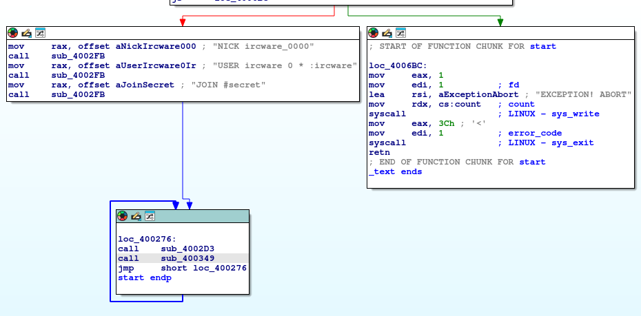

# 🧬 Hack The Box - Reversing Challenge Write-Up: [IRCWare] – [04/05/2025]
***

## 🕵️‍♂️ Challenge Overview
- **Objective:** retrieve the HTB flag
- **Link to the challenge:** https://app.hackthebox.com/challenges/IRCWare
- **Challenge Description:** During a routine check on our servers we found this suspicious binary, although when analyzing it we couldn't get it to do anything. We assume it's dead malware, but maybe something interesting can still be extracted from it?
- **Difficulty:** Easy
- **📦 Provided Files**:
  - File: `IRCWare.zip`  
  - Password: `hackthebox`
  - SHA256: `f48882b8fc0f3b86901d68e1164c24837ab69cafe90e316dc3d1059c27d2b813`
- **📦 Extracted Files**:
  - `ircware`
  - `rev_ircware/ircware`
  - **SHA256 (both):** `5c150a2af6d8f83d6de741bb3fcd8cd1abb4474541763e23ed432d7e5a394805`

---

## ⚙️ Environment Setup
- **Operating System:** Kali Linux
- **Tools Used:**
  - Static: `file`, `sha256sum`, `strings`, `readelf`, `ldd`, `objdump`
  - Dynamic: `ltrace`, `strace`, `IDA Free`, `nc`

---

## 🔍 Static Analysis

### Initial Observations
The file is a 64-bit dynamically linked ELF executable, stripped of symbols. Both the original and the reversed version share the same SHA256 hash, so we proceed with `rev_ircware/ircware`.

```bash
$ file rev_ircware/ircware
ELF 64-bit LSB executable, x86-64, version 1 (SYSV), dynamically linked, interpreter /lib64/ld-linux-x86-64.so.2, stripped

$ sha256sum rev_ircware/ircware
5c150a2af6d8f83d6de741bb3fcd8cd1abb4474541763e23ed432d7e5a394805
```

### Strings Analysis

Interesting output from `strings`:
```
NICK ircware_0000
USER ircware 0 * :ircware
JOIN #secret
WHO *
EXCEPTION! ABORT
PING :
/bin/sh
Accepted
Rejected
Done!
Requires password
PRIVMSG #secret :@exec 
PRIVMSG #secret :@flag
RJJ3DSCP
PRIVMSG #secret :@pass 
```

### Binary Characteristics

- `.text` is small (~1.2KB)
- No relocations
- No imported functions (only NULL in `.dynsym`)
- Large `.bss` (0x2008) — possibly buffer or VM memory
- Not PIE — fixed base (makes RE easier)

These suggest a small binary making raw `syscall`s directly — possibly malware-like.

---

## 💻 Dynamic Analysis

### Initial Behavior

```bash
$ ./ircware
EXCEPTION! ABORT
```

No libc calls visible in `ltrace`. `ltrace` can only show **lib‑function** calls that pass through the dynamic linker.  
Your little 1.2 KB stub never touches libc, so the only thing `ltrace` could print is the program’s own **stdout text**.

`strace` shows more:

```
...
...
socket(AF_INET, SOCK_STREAM, IPPROTO_IP) = 3
connect(3, {sa_family=AF_INET, sin_port=htons(8000), sin_addr=inet_addr("127.0.0.1")}, 16) = -1 ECONNREFUSED
write(1, "EXCEPTION! ABORT", 17)
exit(1)
```

As we can see, the binary tries to connect to `127.0.0.1:8000`. 

I believe that, for the purpose of this challenge, they’ve used a local IP address to make it easier to reverse-engineer. Let’s try opening a listener on local port 8000 and see what happens.

```bash
$ nc -lvnp 8000
listening on [any] 8000 ...
```

Then re-run the binary with strace:

```
connect to [127.0.0.1] from (UNKNOWN) [127.0.0.1]
NICK ircware_5206
USER ircware 0 * :ircware
JOIN #secret
```
And indeed, it established a connection—it appears to be an IRC connection, reminiscent of old-style spyware.

Now, strace it's waiting for input (read function). 

So through our nc terminal we can try to send inputs to the IRC Server we are connected to and check what happens. After a few tests with random strings without anything useful, I decided to use strings that we found in our previous strings analysis:

```irc
PRIVMSG #secret :@exec
-> PRIVMSG #secret :Requires password
```
Interesting! so we need to pass an authentication first. I'll try this then:

```irc
PRIVMSG #secret :@flag
-> PRIVMSG #secret :Requires password
```

Can't print the flag either without authentication. SO I'll try to authenticate with the hardcoded string I found found which seems a password:

```irc
PRIVMSG #secret :@pass
-> PRIVMSG #secret :Rejected

PRIVMSG #secret :@pass RJJ3DSCP
-> PRIVMSG #secret :Rejected
```

No luck — We have no other option but to check the disassembly to see how the password is processed, or whether it's the correct one. I'm doing it in IDA.

---

## 🔬 Reverse Engineering (IDA)

As soon as we open IDA, we can see the main function, and it's easy to identify what happens when the IRC connection is established.



As we can see, there's an endless loop—this is the read/write loop. So let’s dive into the last call within that loop, which handles user input (i.e., the command).

At this point, we're presented with a large flow graph, but thanks to the hardcoded strings, we can easily pinpoint the password check logic at `loc_4003E3`. Stepping through it, we observe the following:

- For each byte of the password (stored in `buf` after a specific prefix):
    
    - It reads one byte into `al`.
        
    - If the byte is `'\r'`, `'\n'`, or `'\0'`, the loop stops.
        
    - If the byte is an uppercase letter (`'A'–'Z'`), it adds `0x11` (17) to it. --> this is the key to solve this challenge.
        
    - Non-uppercase letters are left unchanged.
        
    - The transformed byte is then compared against the corresponding character in the hardcoded string `"RJJ3DSCP"`.
        
- If **all** transformed bytes match the hardcoded string exactly, the program prints “Accepted”; otherwise, it prints “Rejected.”
    

Now, let’s look more closely at the code between `loc_400401` and `loc_40042C`—this is where the input transformation logic takes place:

```
    cmp     al, 'A'
    jb      short skip_transform
    cmp     al, 'Z'
    ja      short skip_transform
    add     al, 0x11        ; <— here’s the ROT-17
    cmp     al, 'Z'
    jbe     short ok_range
    sub     al, 'Z'
    add     al, '@'
skip_transform:
    cmp     [rdi], al        ; compare to byte in "RJJ3DSCP"
    jnz     reject
```

- **If** the input byte falls between `'A'` and `'Z'`:
    
    - It adds `0x11` (17) to it, essentially performing a ROT-17 shift.
        
    - If the result exceeds `'Z'`, it wraps around by subtracting `'Z'` and adding `'@'` (the character before `'A'`), simulating a modulo-26 wraparound.
        
- The transformed byte is then compared to the corresponding byte in the hardcoded string `"RJJ3DSCP"`.
    

So, to retrieve the correct password, we simply reverse this transformation—shift each letter in `"RJJ3DSCP"` back by 17 positions within the uppercase alphabet.

Once decrypted and passed to the IRC server via the `nc` terminal using the format:

```irc
PRIVMSG #secret :@pass new_decrypted_password
```

(sorry, no spoiler of the correct password) — we receive the message:

```
PRIVMSG #secret :Accepted
```

Now we’re authorised to execute further commands! Such as `exec`, or the actual goal of the challenge: retrieving the flag:

```irc
PRIVMSG #secret :@flag
```

and it will answer with the HTB flag! Success!

---

## ✅ Challenges Encountered / Lessons Learned

- Recognizing raw syscall behavior from absence of imports
- Understanding disguised simple logic (ROT17)
- Using `strace` and `nc` to simulate a client-server connection and debug the behavior
- Leveraging hardcoded strings as analysis anchors

---

## 🏁 Conclusion

Despite its minimal structure and misleading hints, this binary implemented a very classic CTF trick: a fake IRC bot with a password-protected flag feature. Reversing the ROT17 cipher and simulating the server connection allowed full control of the bot behavior and ultimately led to flag retrieval.

---

