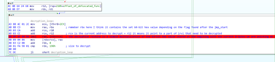
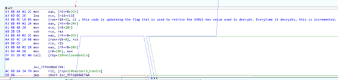

# 🧬 Hack The Box - Reversing Challenge Write-Up: Iterative Virus

* * *

## 🕵️‍♂️ Challenge Overview

**Name of the challenge:** Iterative Virus

**Link to the challenge:** https://app.hackthebox.com/challenges/Iterative%2520Virus

**Difficulty:** Medium

**📄 Description**: While cleaning up the workspace of a recently retired employee, we noticed that one of the core files of the very important programs they were working on didn't match up with the backups we have of it, could you check it out for us?

**📦 Provided Files**:

- Zip File: Iterative Virus.zip

- ZIP Password: hackthebox

- SHA-256 of the Zip: `0453c9e802b76e7d318d9b2762d534a3e2b34befd7394441aa2b4a91bb275499`

- After extraction, we get: `HELLO_WORLD_INFECTED_!!!.exe`

* * *

## 🧪 Initial Analysis

### 🔍 Basic Metadata with CFF Explorer

**File Type:** Portable Executable 64-bit (PE64)

**File Size:** 100.38 KB (102784 bytes)

**SHA-1:** `595C8715868A5A26435CD1099200A7F5E614D19B`

**WARNING:** Always rename and change the extension of potentially malicious files (e.g. from .exe to .bin) to avoid accidental execution.

### 🧾 File Header

- Machine: AMD64 (K8) `0x8664`

- Number of Sections: 7

- TimeDateStamp: `DEADC0DE` (suspicious / funny)

### ⚙️ Optional Header

- Magic: PE64

- AddressOfEntryPoint: `0x1C000` (inside `.ivir` section) --> definitely unusual and strange! Also many AV detect this as malicious.

### 📁 Data Directory

- Contains standard directories: Import, Exception, Relocation, Debug, Configuration, IAT

- Not a .NET binary

### 🧩 Sections

- Standard sections: .text, .rdata, .data, .pdata, _RDATA, .reloc

- Suspicious section: `.ivir` with following metadata:

| Name | VirtualSize | VirtualAddress | RawSize | RawAddress | Characteristics  |
|--------|--------|--------|--------|--------|--------|
| .ivir | 00000D80 | 0001C000 | 00000D80 | 00018400 | 60500060 |


A quick hex view of `.ivir` shows:


We can read some readable words but not their entirety, which means they are probably obfuscated or split. Interestingly, these strings are API and DLL names, which may suggest that the file will load DLLs and APIs dynamically at runtime. Let's remember this.

### 🔤 Other strings

- The other only visible string of interest is: `Hello World!`
- This is printed to the console upon execution of the program.(since it is a virus, we should not run it in the system! But I can tell you that this is the string printed by the program when it runs in the console). We can definitely use it to set a breakpoint or check what part of the code uses it. (And we will find that it is the main function).
- Nothing else of interest: the rest are obfuscated strings or normal API calls.

### 📥 Import Table

Only `kernel32.dll` is imported (as opposed to the DLL names we saw in the strings...interesting).

### 🧰 PEStudio Analysis

I passed the file to PE studio so it could tell me which API has potentially malicious behavior and it showed the following:


The following called my attention because are potential malware-related APIs:

- FindFirstFile
- FindNextFile
- WriteFile

These are typical file iteration and manipulation APIs used in self-replicating malware. Very common APIs that can be used to find and infect/manipulate other files. Anyway, definitely important to find their use and set a breakpoint.

I don't see a clear anti-debug API.

### 🧠 PE-Bear Observations
To make our evaluation more complete, I also passed this binary into PE-Bear and it also gives us information about the Rich Header (this is encrypted information that Microsoft includes in the header when compiling the file) and shows for example how it was constructed (not useful for this challenge, however).

- Rich Header:


- Optional Header checksum set to zero (something I hadn't noticed before on CCF explorer) — uncommon:


To conclude our recognition assessment, I see that there are no resources.

* * *

## 🧷 Static Code Analysis with IDA Free

Let us now proceed with the static analysis of the code. For this purpose I use IDA free: 
Open IDA, load the binary and analyze it. Note that I will show screenshota of my IDA file with the variables already renamed, so that it is easier to understand and explain.

🎯 As soon as IDA finishes the analysis, we are shown the entry point that IDA calls `start` and we see this:


The entry point is inside `.ivir`. It is very ambiguous that an entry point of a normal exe starts with a jump to somewhere else. Let's follow and check where it goes. I can see this long graph:


This is basically the main function of the virus, and we need to understand step by step what it does. It is very important to rename the functions that we will see in the initial part, because we will soon understand very important things about the code. So let's do that.
In the first block at the top of the graph we see the following:
- Function prolugue:
	- Save register values on the stack (push)
	- Saving the previous stack frame
	- Preparing the new stack to accommodate local variables.
- Resetting the rax (it will receive a new value after the first call), we see the following 2 instructions
- Load ptr to a local variable value in RCX and then
- call a function

We need to follow this first function call to understand what it does:


This first function dynamically resolves GetProcAddress via the following steps:

- Obtaining the TEB value
- Get the PEB address from the TEB
- Point to the address of the Ldr structure stored in the PEB structure.
- Set a pointer to the second element found in `Ldr->InInitializationOrderModuleList` (which is the base address of the kernel32.dll)
- Then walks through the PE header structure of the kernel32.dll loaded in the process to find its export table and from there loops through all the exported API names to find `GetProcAddress`
- It returns by saving the address of GetProcAddress in RAX

Then, if we go back to the previous main code, we see that a few lines down that first function call is saved in register R12 and can be called multiple times in the first block!
So it is clear that the code dynamically retrieves at runtime the addresses of other APIs it needs. But which APIs? Let's see.
Immediately after the call to get the address from GetProcAddress, we see another call; let's follow it:


Interesting structure! Basically, depending on the parameter received when calling the function, it passes to one branch or another. Each branch reconstructs a string in a buffer (passed as a parameter to the function) and if we pay attention to what these strings are, yes, they are APIs!
Basically, depending on the `flag` passed as a parameter, it will retrieve the name of a specific API. Simple as that.

So, the above code constructs API names on the fly based on input flags.

Returning again to the previous code, we can now know which APIs are retrieved using the combination of `this call + GetProcAddress`. Notice also that the addresses of many APIs are saved in local variables for their future use, and I have renamed them to get a clearer view of all the rest of the code that we will see later. Here is what the first block of the main virus function looks like now:


We see that it retrives many interesting APIs! Dynamically resolved functions:
CreateFileA, CreateFileMapping, MapViewOfFile, GetFileSize, ExitProcess, CloseHandle
FindFirstFile, FindNextFile, etc.

These are standard APIs used in file infection routines.

Let us now pay attention to the last part of this first block and see this:


It loads into r14 the address of the `[entry point + 5]` in our file and compares it to the value 5.
This is very strange...basically pointing to `entry point + 5` means that the code is pointing just after the first jump (which is indeed 5 bytes) we saw to the entry point! This suggests that after the jump to the entry point there is “useful” data that the virus is using! At first we did not see them because IDA was showing only the recognizable opcode it could, the jump. But if we look at it in text view we see this:


In fact the next byte is a data byte and right now it is storing the value 1.
So why is it comparing it to 5? What does 5 mean? What happens if the value is 5? Let's follow the branch that takes if the value is 5 and see what happens:


if we follow the call, it brings us to this:


We are still inside the .ivir section of the PE, but here we see a number of very strange opcodes, including an int 7Eh instruction. If we look at the raw opcode, we immediately see that it is an obfuscated/encrypted function!
Very interesting, this is the easter egg we need to decrypt!
Okay, since this branch is useless at the moment, let's go back to analyzing what happens if the flag in `[entry point + 5]` is not 5:


We see that it is loading the address of the obfuscated function into a registry! A very good sign that we are in the right place that can lead us to decryption. Even more interesting is the storage in a local variable of what appears to be an offset encoded from the beginning of the obfuscated function!
Right after that it uses that flag again (which should be 5) and checks its value: the code tells us that this “flag” can only have 5 values from 0 to 4 and our original virus has a value of 1.
Depending on the value of this flag, different 64-bit hexadecimal values are stored in the rbx register. If we see the usage of this register, we see that it is not used until very far from this “loading point,” so there is something going on in between... Just remember that RBX contains these strange flag-specific values for now.

Let's continue with our analysis in the next block: thanks to the fact that we renamed the variables in the first block, this part of the code is very easy to understand, and we see that the call to the code in sequence (I am not attaching screenshots because now it is easy to understand with description):
- Call to FindFirstFileA with the parameter `*.exe` -> the virus is looking for more victims to infect
- Call to CreateFileA with the OPEN_EXISTING flag -> the virus gets a handle to a new potential victim (note that the first file it will find is just this exe)
- Call to GetFileSize -> gets the size of the new victim exe file (the first call, since our exe file is already in use, will fail with the value -1, which the code checks correctly and, in that case, skips the search for a new file).
- Create a map of the new victim file found (with call to CreateFileMap) and
- With call to MapViewOfFile create a view mapping of the victim exe file found in the current address space (so that the infector can work and modify the new victim).

At this point the infector performs some checks on the potential victim file:
- First check the MZ header signature (to confirm that it is an exe file)
- Check if the file is an AMD64 architecture (otherwise skip it) -> makes sense: if it tries to infect an intel-type exe with AMD64 instructions, it might crash the infected victim normal behavior
- Check if `nt header -> TIMEDATESTAMP` is = to `THIS` -> this is just a security system implemented by the author to avoid accidentally infecting all AMD64 exe in our system! (thank you)

If all the above checks go as planned, the infector proceeds to the victim's infection part:
1.	Checks if there is enough space to add a new section.
2.	If so, it constructs the string name for the new section (which is actually `.ivir` like the current infector)
3.	Calculate the values of VirtualAddress, VirtualSize, RawAddress, and RawSize.
4.	Writes the information of the new section in the PE header (values of VirtualAddress, VirtualSize, RawAddress and RawSize and characteristic that will have a value of `60500060h`).
5. modifies other values in the PE header to make it work properly
	a.	Corrects the value of the number of sections in the `nt->optional header`
	b.	Corrects the TimeDataStamp with the value `DEADC0DE`.
6.	When all this is done, it proceeds to find the bytes of the current exe that need to be “transferred” (copied) to the new section of the infected file and copies them to the address of the newly created section.

All this represents a classic working implementation of an exe file infector (like a typical virus from the 1990s!).

We finally get to the end of this long piece of code that only serves to infect other files, but our goal let's not forget was to find out what's inside that encrypted code!
And that seems to have happened exactly at the end of the process of infecting a new file, so here we are now:



💻 **This is the most important part of the challenge.**

As you can see, the code is:
1. loading into r12 the offset of the obfuscated function stored in the local variable. This is a sign that we are in the next relevant part of the code that will manipulate the encrypted function (our real goal).
2. Now we enter a loop:
3. It loads the RBX register that contains the 64-bit hexadecimal flag-dependent value
4. creates a pointer to the current obfuscated function + the offset saved earlier
5. It then performs a multiplication of the current 8 bytes of the obfuscated function with that 64-bit hexadecimal value
6. Then replaces the current pointer to the obfuscated function with the result of the multiplication

**This is clearly the decryption routine!**

Basically, it decrypts the encrypted code using the 64-bit hexadecimal value as the key and a “multiplication algorithm” to decrypt it. In C style it would look like this:
```
For(int i=0; i < 0x198; i+=8)
	Obfuscated_function[i] = Obfuscated_function[i] * 64_bit_hex_key
```

Now, if we let the decryption happen until the end (by running the code at runtime) we see that we do not get a clear function! So what is the purpose of this decryption?

💡 Simple: remember that the obfuscated function is called only when the flag is 5? This means that the right decrypted function is obtained only when using the last 64-bit hexadecimal value (when the flag=4).
So at this point, I tried to statically decrypt those 198h bytes with the hexadecimal value of the flag = 4, but I still did not get the right deobfuscated function. I then decided to go further in the analysis and saw that after the decryption routine there is this block:



which clearly shows that the current `flag` located 5 bytes after the entry point is updated each time the obfuscated function is decrypted. So the flag is also a counter.
This tells me that to get the function obfuscated we have to decrypt it step by step using all the 64-bit hex keys from 1 to 4 (not from 0 because the author provided this file with the value 1, suggesting that the first decryption has already happened).
I then created a simple script in python to statically decrypt it with all keys from 1 to 4:

* * *

## 🐍 Decryption Script (Python):
```
import argparse
import pefile
from struct import unpack_from, pack_into

# Constants: default key array (do not change order)
KEYS = [
    0x28C8AA0746A75909,
    0x6E2368B9C685770B,
    0x0EB7FD64E061C1A3D,
    0x0CB8FF2D53D7505A1,
    0x0F1EF554206DCE4D,
]


def decrypt_blob(blob: bytearray, key: int) -> bytearray:
    """
    Decrypt an 8-byte little-endian QWORD in place with the given key.
    """
    x = unpack_from("<Q", blob, 0)[0]
    y = (x * key) & 0xFFFFFFFFFFFFFFFF
    pack_into("<Q", blob, 0, y)
    return blob


def main():
    parser = argparse.ArgumentParser(
        description="Decrypt a 408-byte encrypted region in a PE file using provided keys."
    )

    parser.add_argument(
        "-i", "--input",
        required=True,
        help="Path to the input PE executable to decrypt"
    )
    parser.add_argument(
        "-o", "--output",
        default="decrypted.exe",
        help="Path for the output decrypted PE (default: decrypted.exe)"
    )
    parser.add_argument(
        "-r", "--rva",
        required=True,
        type=lambda x: int(x, 0),
        help="RVA of the start of the encrypted region (hex or decimal)"
    )
    parser.add_argument(
        "-s", "--size",
        default=0x198,
        type=lambda x: int(x, 0),
        help="Size in bytes of the encrypted blob (default: 0x198)"
    )

    args = parser.parse_args()

    # Load the PE
    pe = pefile.PE(args.input)
    data = bytearray(open(args.input, "rb").read())

    # Map RVA to file offset
    offset = pe.get_offset_from_rva(args.rva)

    # Decrypt in place: iterate through 8-byte QWORDs
    for idx in range(1, len(KEYS)):
        key = KEYS[idx]
        for off in range(offset, offset + args.size, 8):
            chunk = data[off:off + 8]
            data[off:off + 8] = decrypt_blob(chunk, key)

    # Write decrypted file
    with open(args.output, "wb") as f:
        f.write(data)

    print(f"Decrypted file written to {args.output}")


if __name__ == "__main__":
    main()

```

It takes as input the file to decrypt and the RVA where the encrypted function is located and applies the decryption multiplication algorithm (`Obfuscated_function[i] = Obfuscated_function[i] * 64_bit_hex_key`) 4 times with the correct hexadecimal value each time.

* * *

## 🔓 Analysis of the decrypted function:
Finally I got the file “decrypted.exe”. I opened it again with IDA and went to the first flag check against 5.
I bypassed this check by simply patching the 5th byte after the entry point with the value 5 and now followed the call to `obfuscated_function` which is now decrypted!

```
.ivir:00007FF72F79C7E4 ; =============== S U B R O U T I N E =======================================
.ivir:00007FF72F79C7E4
.ivir:00007FF72F79C7E4 ; Attributes: bp-based frame fpd=70h
.ivir:00007FF72F79C7E4
.ivir:00007FF72F79C7E4 sub_7FF72F79C7E4 proc near              ; CODE XREF: start_0+162↑p
.ivir:00007FF72F79C7E4                                         ; DATA XREF: start_0:loc_7FF72F79C45C↑o
.ivir:00007FF72F79C7E4
.ivir:00007FF72F79C7E4 var_150= dword ptr -150h
.ivir:00007FF72F79C7E4 var_14C= dword ptr -14Ch
.ivir:00007FF72F79C7E4 var_148= byte ptr -148h
.ivir:00007FF72F79C7E4 var_147= dword ptr -147h
.ivir:00007FF72F79C7E4 var_143= dword ptr -143h
.ivir:00007FF72F79C7E4 var_13F= word ptr -13Fh
.ivir:00007FF72F79C7E4 var_13D= byte ptr -13Dh
.ivir:00007FF72F79C7E4 var_13C= dword ptr -13Ch
.ivir:00007FF72F79C7E4 var_138= word ptr -138h
.ivir:00007FF72F79C7E4 var_130= byte ptr -130h
.ivir:00007FF72F79C7E4 var_20= byte ptr -20h
.ivir:00007FF72F79C7E4 arg_0= dword ptr  10h
.ivir:00007FF72F79C7E4 arg_8= qword ptr  18h
.ivir:00007FF72F79C7E4 arg_10= qword ptr  20h
.ivir:00007FF72F79C7E4
.ivir:00007FF72F79C7E4 mov     [rsp-8+arg_8], rbx
.ivir:00007FF72F79C7E9 mov     [rsp-8+arg_10], rsi
.ivir:00007FF72F79C7EE push    rbp
.ivir:00007FF72F79C7EF push    rdi
.ivir:00007FF72F79C7F0 push    r12
.ivir:00007FF72F79C7F2 push    r14
.ivir:00007FF72F79C7F4 push    r15
.ivir:00007FF72F79C7F6 lea     rbp, [rsp-50h]
.ivir:00007FF72F79C7FB sub     rsp, 150h
.ivir:00007FF72F79C802 mov     rsi, rdx
.ivir:00007FF72F79C805 mov     rbx, rcx
.ivir:00007FF72F79C808 xor     edx, edx
.ivir:00007FF72F79C80A lea     rcx, [rsp+170h+var_130]
.ivir:00007FF72F79C80F call    sub_7FF72F79C01C
.ivir:00007FF72F79C814 mov     rdx, rax
.ivir:00007FF72F79C817 mov     rcx, rbx
.ivir:00007FF72F79C81A call    rsi
.ivir:00007FF72F79C81C mov     edx, 0Bh
.ivir:00007FF72F79C821 lea     rcx, [rsp+170h+var_130]
.ivir:00007FF72F79C826 mov     rdi, rax
.ivir:00007FF72F79C829 call    sub_7FF72F79C01C
.ivir:00007FF72F79C82E mov     rdx, rax
.ivir:00007FF72F79C831 mov     rcx, rbx
.ivir:00007FF72F79C834 call    rsi
.ivir:00007FF72F79C836 mov     edx, 1
.ivir:00007FF72F79C83B lea     rcx, [rsp+170h+var_130]
.ivir:00007FF72F79C840 mov     r14, rax
.ivir:00007FF72F79C843 call    sub_7FF72F79C01C
.ivir:00007FF72F79C848 mov     rcx, rax
.ivir:00007FF72F79C84B call    rdi
.ivir:00007FF72F79C84D mov     edx, 2
.ivir:00007FF72F79C852 lea     rcx, [rsp+170h+var_130]
.ivir:00007FF72F79C857 mov     r15, rax
.ivir:00007FF72F79C85A call    sub_7FF72F79C01C
.ivir:00007FF72F79C85F mov     rdx, rax
.ivir:00007FF72F79C862 mov     rcx, r15
.ivir:00007FF72F79C865 call    rsi
.ivir:00007FF72F79C867 mov     edx, 11h
.ivir:00007FF72F79C86C lea     rcx, [rsp+170h+var_130]
.ivir:00007FF72F79C871 mov     r12, rax
.ivir:00007FF72F79C874 call    sub_7FF72F79C01C
.ivir:00007FF72F79C879 mov     rcx, rax
.ivir:00007FF72F79C87C call    rdi
.ivir:00007FF72F79C87E mov     edx, 10h
.ivir:00007FF72F79C883 lea     rcx, [rsp+170h+var_130]
.ivir:00007FF72F79C888 mov     rdi, rax
.ivir:00007FF72F79C88B call    sub_7FF72F79C01C
.ivir:00007FF72F79C890 mov     rdx, rax
.ivir:00007FF72F79C893 mov     rcx, rdi
.ivir:00007FF72F79C896 call    rsi
.ivir:00007FF72F79C898 lea     rdx, [rbp+70h+arg_0]
.ivir:00007FF72F79C89F mov     [rbp+70h+arg_0], 100h
.ivir:00007FF72F79C8A9 lea     rcx, [rsp+170h+var_130]
.ivir:00007FF72F79C8AE call    rax
.ivir:00007FF72F79C8B0 cmp     [rbp+70h+arg_0], 19h
.ivir:00007FF72F79C8B7 jnz     loc_7FF72F79C94A
.ivir:00007FF72F79C8BD xor     edx, edx
```

✅ What I’m seeing here (even without dynamic execution, but just through static analysis) is that the code reconstructs the HTB flag on the stack! :)
I haven't shared the fully deobfuscated code to avoid spoiling the flag. Job done! Really fun challenge!

PS: If you're curious, you can see how the flag is used: at runtime it loads `LoadLibraryA`, `FreeLibraryA`, `user32.dll`, `advapi32.dll`, and `GetUserNameA`. If the username length is `25h` (most porbably you need to bypass this as your Username won't be exactly 37 chars), it triggers a MessageBox displaying the HTB flag.

* * *

## 🏁 Conclusion

This challenge was a great example of a manual decryptor virus using iterative decryption steps to hide its true payload. It showcased real-world malware behavior, including:

- Runtime API resolution

- File iteration and infection logic

- Header patching and stealth tactics

- Multi-stage decryption and hidden payloads
