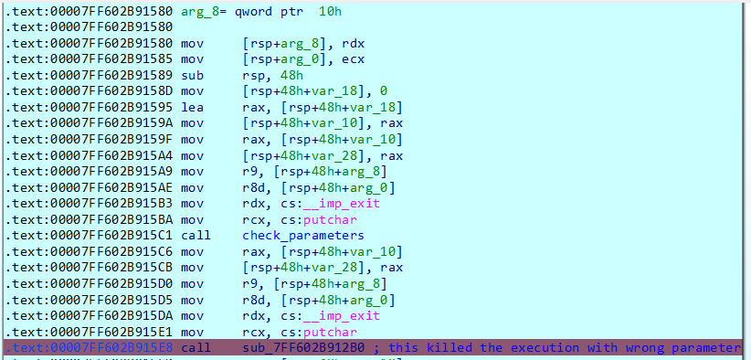
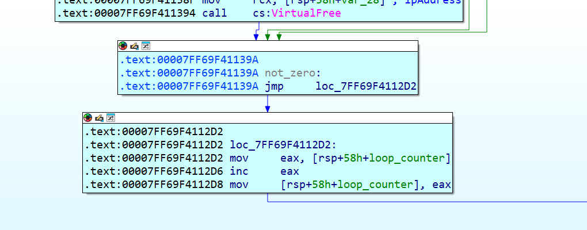
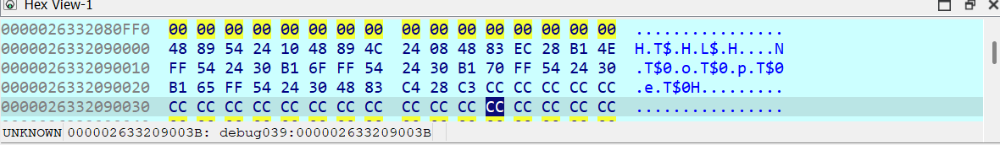
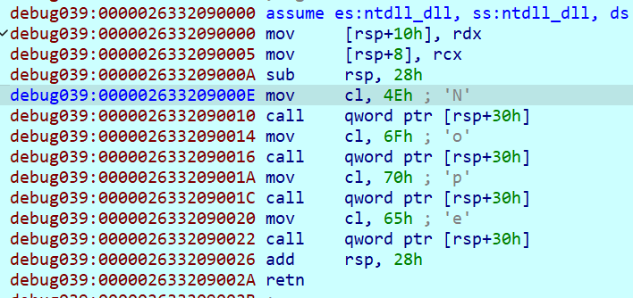

# 🧬 Hack The Box - Reversing Challenge Write-Up:[Partial Encryption] – [08/07/2025]
***

## 🕵️‍♂️ Challenge Overview
- **Objective:** retrieve the HTB flag
- **Link to the challenge:** https://app.hackthebox.com/challenges/Partial%2520Encryption
- **Challenge Description:** Static-Analysis on this program didn't reveal much. There must be a better way to approach this...
- **Difficulty:** Easy
- **📦 Provided Files**:
	- File: `Partial Encryption.zip`  
	- Password: `hackthebox`
	- SHA256: `5ea0f8371d67e3f7b9221b5b604faac20312267ffe16633ac9a2c43fa88662ab` 
- **📦 Extracted Files**:
	-  File: `partialencryption.exe`
	- SHA256: `ae46c6efbb950f62a83a789cb4de515e5e511be6f8197c2e79a59e680b52afd4`
---

## ⚙️ Environment Setup
- **Operating System:** `Windows 10`
- **Tools Used:**
  - Static: `file`, `sha256sum`, `strings`,`CFF Explorer`, `PE Bear` 
  - Dynamic: `IDA Free`

---

## 🔍 Static Analysis

#### Initial Observations
- File: 
```bash
file partialencryption.exe  
partialencryption.exe: PE32+ executable (console) x86-64, for MS Windows, 5 sections
```

- strings: 
```bash 
strings partialencryption.exe  
!This program cannot be run in DOS mode.
Rich
.text
`.rdata
@.data
.pdata
@.reloc
XHcD$hA
9D$ }Y
D$ f
D$0HcD$ Hk
D$@H
T$0H
HcD$ Hk
HcD$hL
L$$A
D$(H
L$ D
D$ H
D$ H
D$0H
T$XH
T$0A
D$(H
D$(H
D$8H
T$XH
T$8A
L$ D
D$ H
D$ H
D$0H
T$XH
T$0A
D$(H
D$(H
D$8H
T$XH
T$8A
L$ D
HcL$ H
T$xH
D$(H
D$(H
D$8H
T$hH
T$8A
D$0H
D$0H
D$@H
T$hH
T$@A
L$ D
D$0H
D$0H
D$PH
D$ L
T$PA
D$8H
D$8H
D$XH
D$ L
T$XA
D$@H
D$@H
D$`H
D$ L
T$`A
D$HH
D$HH
D$hH
D$ L
T$hA
D$0H
D$8H
D$8H
D$ L
L$XD
D$PH
D$8H
D$ L
L$XD
D$PH
D$8H
D$ L
L$XD
D$PH
D$8H
D$ L
L$XD
D$PH
\$@H
t$HH
t!eH
uxHc
uTL+
\$ UH
M H1E
 H3E H3E
\$HH
L$0L
L$(H
L$ 3
L$PH
D$PH
D$@H
D$H3
u0HcH<H
;csm
\$03
\$0H
\$0H
ntelA
GenuD
ineI
t(=`
t!=p
 w$H
T$ H
D$ "
D$ $
\$(3
t$0H
.text$mn
.text$mn$00
.text$x
.idata$5
.00cfg
.CRT$XCA
.CRT$XCAA
.CRT$XCZ
.CRT$XIA
.CRT$XIAA
.CRT$XIAC
.CRT$XIZ
.CRT$XPA
.CRT$XPZ
.CRT$XTA
.CRT$XTZ
.rdata
.rdata$voltmd
.rdata$zzzdbg
.rtc$IAA
.rtc$IZZ
.rtc$TAA
.rtc$TZZ
.xdata
.idata$2
.idata$3
.idata$4
.idata$6
.data
.bss
.pdata
VirtualAlloc
VirtualProtect
VirtualFree
QueryPerformanceCounter
GetCurrentProcessId
GetCurrentThreadId
GetSystemTimeAsFileTime
InitializeSListHead
RtlCaptureContext
RtlLookupFunctionEntry
RtlVirtualUnwind
IsDebuggerPresent
UnhandledExceptionFilter
SetUnhandledExceptionFilter
IsProcessorFeaturePresent
GetModuleHandleW
KERNEL32.dll
__C_specific_handler
__current_exception
__current_exception_context
memset
VCRUNTIME140.dll
exit
putchar
_seh_filter_exe
_set_app_type
__setusermatherr
_configure_narrow_argv
_initialize_narrow_environment
_get_initial_narrow_environment
_initterm
_initterm_e
_exit
_set_fmode
__p___argc
__p___argv
_cexit
_c_exit
_register_thread_local_exe_atexit_callback
_configthreadlocale
_set_new_mode
__p__commode
_initialize_onexit_table
_register_onexit_function
_crt_atexit
terminate
api-ms-win-crt-runtime-l1-1-0.dll
api-ms-win-crt-stdio-l1-1-0.dll
api-ms-win-crt-math-l1-1-0.dll
api-ms-win-crt-locale-l1-1-0.dll
api-ms-win-crt-heap-l1-1-0.dll
%.<R
;{d{
&{D{
}>j}o.}
BUtRZ<2yyyyiyyyyyyyiyyyv
;{d{
&{D{
}>j}o.}
dZ<8
;{d{
&{D{
}>j}o.}
dZ<8
Uf*>
O*~O
;v3v3#
;{d{
&{D{
}>j}o.}
```

I noticed some obfuscated strings, random ASCII characters, common language runtime usage (typical of C/C++ applications on Windows), and some interesting function calls such as: `memset`, `putchar`, `VirtualAlloc`, `VirtualProtect`, `VirtualFree`, along with other functions that can be useful to break in dynamic analysis.

---
### Windows Analysis

**First things first:** let's rename the file from `.exe` to `.bin` to avoid accidental execution.

---

### CFF Explorer

I used **CFF Explorer** on Windows to quickly perform a static analysis of the file. Here's what I found:

- **PE64**
    
- **Microsoft Visual C++ 8.0**
    
- **Size:** only 13 KB
    
- **Machine:** AMD64
    
- **Sections:** 5
    
- **NT Timestamp:** `0x61EE9CAE` — nothing unusual; it decodes to a valid date
    
- In the **Optional Header**, nothing special: the entry point is in the `.text` section as expected
    
- **Subsystem:** Windows Console (CLI application)
    
- **Data Directories Present:** `import`, `exception`, `relocation`, `debug` (interesting — we could investigate this further), and `configuration directory` (I haven’t worked with this one before, so I’ll take a look using PE Bear)
    

As mentioned, no suspicious sections detected. The 5 sections are:

- `.text`
    
- `.rdata`
    
- `.data`
    
- `.pdata`
    
- `.reloc`
    

There are no significant differences between the **VA size** and **Raw Size**. Also, no other executable regions apart from `.text` — nothing suspicious here.

---

### Import Address Table (IAT) Analysis

The IAT shows `KERNEL32.dll` and `VCRUNTIME140.dll`, which is expected for a VC++ executable on Windows. There are some malware-like APIs, but honestly, I’d rather not focus too much on the exported APIs from `KERNEL32.dll`, as they can often be invoked by CRT initializers multiple times — they may well be false positives. So let’s skip that part.

---

### Debug Directory

The debug directory shares the same timestamp as the NT header, so no signs of tampering there.

---

Nothing else particularly useful at this stage. Let's move on to the next tool to get a better understanding of the other data directories or check for any visual encryption within the sections.

### PE Bear

- **Rich Header Analysis:**  
    The analysis of the Rich Header (typically encrypted, but the PE Header can decrypt it) confirms a **Visual Studio 2015 build**.
    
- **Load Config Directory:**  
    This only shows the information required to set up a secure process (e.g. `SecurityCookie`, `GuardCFCheck` function address, etc.).  
    Nothing particularly useful here.
---

## 💻 Dynamic Analysis

### Behavior Analysis

Since it's a relatively simple challenge, I won't spend time analyzing events, network activity, etc. Instead, let's just take a look at what happens when the binary is executed from the command line (warning - always in VM and previous to snapshot creation):

```bash
C:\Users\xxx\Desktop\rev_partialencryption>partialencryption.exe
./chal <flag>
```

So the expected usage is to pass an argument to the executable.
```bash
C:\Users\xxx\Desktop\rev_partialencryption>partialencryption.exe hola
Nope

C:\Users\xxx\Desktop\rev_partialencryption>partialencryption.exe hola123
Nope

C:\Users\xxx\Desktop\rev_partialencryption>chal.exe hola
Nope

```

The binary simply returns `"Nope"` for incorrect inputs, and it appears both `partialencryption.exe` and `chal.exe` exhibit the same behavior.

### IDA Free 9.1

Let’s proceed with the **IDA Free** analysis.

Since I already know the challenge requires a string parameter, I set the argument `hola123` when running the binary inside IDA.

As soon as the binary is loaded, we're presented with the `main` function. A quick scan of the calls and strings shows some `putchar` calls and three function calls in total.

---

During the first execution, I step over the initial calls:

- The **first call** checks whether any parameters were passed (if not, the program exits).
    
- The **second call**, when stepped over, immediately terminates the program (because the parameter we provided is incorrect).
    

So, the **second call** is our area of interest — this is where the flag comparison logic takes place.

 

Let’s step into that second function and examine its logic:

 

At the beginning of the function, we see:

- Parameters being saved into local variables
    
- Stack preparation
    
- Initialization of `var_38` to zero — this will serve as a **loop counter**
    

In the following block, the counter is compared against 22, indicating a loop structure like: `for (i = 0; i < 22; i++)`. But **what exactly are we looping through**? That’s what we need to find out next.


In the next block, we observe the program setting a pointer to `argv[1]` and checking each character individually. It looks for the string terminator (`\0`) — indicating the **end of the input string**. If the character at the current index is not `0`, it skips the conditional block and proceeds here:

 

This simply increments the counter and restarts the loop, continuing until it reaches the end of the input string. 

 

When it reach the end of the input string, execution moves here:

 

Since the input is incorrect anyway, I decided to **cheat by patching the ZF (Zero Flag)** to force entry into the yellow block and analyze it.

The first small block is trivial:
```asm
eax = 0  
if (eax == 1) goto counter_increment
```

(So, effectively a no-op in this case.)

---

### Yellow Block Analysis

1. The value `0x40` (`@`) is loaded into `edx` - this will see is used as decryption key-
    
2. A memory address from the `.data` section is loaded into `rcx`.  
    It contains:
 

Likely the **encrypted payload**.

A function is called — I followed it:

- First, it makes a call to `VirtualAlloc`, presumably to allocate new memory for the **decrypted content**.
    
- The following block clearly shows a **loop performing arithmetic operations**, which strongly suggests this is the **decryption routine**.
        
 

I continued to trace the decryption process and observed the output in memory:

 

- It’s **not a string**, but it **resembles opcodes**, which confirms that what’s being decrypted is **executable code**.
    
- As suspected, a `VirtualProtect` call follows, which marks this newly decrypted memory region as **executable**.  
    After checking the decrypted function:

 

1. It simply prints **"Nope"** — confirming this is the failure message.  
    So, somewhere else, there **must also be a decryption of the success path**.
    
2. After this, the program:
    
    - Stores the address of the decrypted "Nope" code in a few variables
        
    - Calls the function to display the message
        
    - Calls `VirtualFree` to clean up the memory
        
    - Resets `eax` to `0`
        

---

### Red Block

Immediately after, a **similar decryption routine** appears — I’ve marked this one as **red**.  
This time, the decryption **uses `0x30` as the key**:    

 

Following the same process:

- It decrypts a new chunk of memory
    
- I analyzed the result:    

 

It appears to be an **exit routine**, which is then executed to terminate the program.

### Backtracking and New Direction

At this point, there's **no more code left to dynamically explore** — and all execution paths so far have led to failure. So it's time to **walk back, re-evaluate the clues**, and determine the next logical step.

---

### Challenge Details

- **Name:** _Partial Encryption_
    
- **Description:** _Static analysis on this program didn't reveal much. There must be a better way to approach this..._
    

This clearly suggests that **some important logic is hidden at runtime**, and **not easily visible through static analysis**. Based on what we've seen so far, it's evident that:

- Execution exits early through one of the dynamically decrypted functions (e.g. `decrypted_exit`).
    
- There's likely **another path in `main` that we never reach** due to this early exit.
    
- The name _Partial Encryption_ implies only _parts_ of the binary are encrypted at runtime, possibly conditionally decrypted.
    

---

### Strategy: Runtime Patching

The idea is to **bypass the early exit** and continue execution within the original `main` function.

So I patched the call to the `decrypted_exit` function using NOPs:

 

This effectively **neutralizes the premature exit**, allowing execution to flow back into the rest of `main`.
### Result: Access to New Code

After bypassing the exit, I successfully returned to a deeper section of the `main` function:

 

Following this new path reveals **additional decrypted blocks**, similar to what we've seen earlier — likely decrypted in-memory using routines that:

- Load encrypted data from the `.data` section
    
- Use a key (`edx` value) and a loop to decode the content
    
- Allocate executable memory with `VirtualAlloc`
    
- Set permissions with `VirtualProtect`
    
- Execute the now-decrypted logic
    

---

### Outcome

As a result of this bypass, **four new code sections were decrypted and executed** — unlocking the **actual core of the challenge** that was previously unreachable due to the early failure path.

---

Next step:  
Now that we've accessed these new decrypted code blocks, the focus should shift to analyzing them one by one

```asm
debug037:000001C473450000 assume es:ntdll_dll, ss:ntdll_dll, ds:ntdll_dll, fs:ntdll_dll, gs:ntdll_dll

debug037:000001C473450000 mov [rsp+20h], r9

debug037:000001C473450005 mov [rsp+18h], r8d

debug037:000001C47345000A mov [rsp+10h], rdx

debug037:000001C47345000F mov [rsp+8], rcx

debug037:000001C473450014 sub rsp, 28h

debug037:000001C473450018 mov eax, 8

debug037:000001C47345001D imul rax, 1

debug037:000001C473450021 mov ecx, 1

debug037:000001C473450026 imul rcx, 0

debug037:000001C47345002A mov rdx, [rsp+48h]

debug037:000001C47345002F mov rax, [rdx+rax]

debug037:000001C473450033 movsx eax, byte ptr [rax+rcx]

debug037:000001C473450037 cmp eax, 48h ; 'H'

debug037:000001C47345003A jz short loc_1C473450045

debug037:000001C47345003C mov dword ptr [rsp], 1

debug037:000001C473450043 jmp short loc_1C47345004C

debug037:000001C473450045 ; ---------------------------------------------------------------------------

debug037:000001C473450045

debug037:000001C473450045 loc_1C473450045: ; CODE XREF: debug037:000001C47345003A↑j

debug037:000001C473450045 mov dword ptr [rsp], 0

debug037:000001C47345004C

debug037:000001C47345004C loc_1C47345004C: ; CODE XREF: debug037:000001C473450043↑j

debug037:000001C47345004C mov rax, [rsp+50h]

debug037:000001C473450051 mov ecx, [rsp]

debug037:000001C473450054 mov eax, [rax]

debug037:000001C473450056 or eax, ecx

debug037:000001C473450058 mov rcx, [rsp+50h]

debug037:000001C47345005D mov [rcx], eax

debug037:000001C47345005F mov eax, 8

debug037:000001C473450064 imul rax, 1

debug037:000001C473450068 mov ecx, 1

debug037:000001C47345006D imul rcx, 1

debug037:000001C473450071 mov rdx, [rsp+48h]

debug037:000001C473450076 mov rax, [rdx+rax]

debug037:000001C47345007A movsx eax, byte ptr [rax+rcx]

debug037:000001C47345007E cmp eax, 54h ; 'T'

debug037:000001C473450081 jz short loc_1C47345008D

debug037:000001C473450083 mov dword ptr [rsp+4], 1

debug037:000001C47345008B jmp short loc_1C473450095

debug037:000001C47345008D ; ---------------------------------------------------------------------------

debug037:000001C47345008D

debug037:000001C47345008D loc_1C47345008D: ; CODE XREF: debug037:000001C473450081↑j

debug037:000001C47345008D mov dword ptr [rsp+4], 0

debug037:000001C473450095

debug037:000001C473450095 loc_1C473450095: ; CODE XREF: debug037:000001C47345008B↑j

debug037:000001C473450095 mov rax, [rsp+50h]

debug037:000001C47345009A mov ecx, [rsp+4]

debug037:000001C47345009E mov eax, [rax]

debug037:000001C4734500A0 or eax, ecx

debug037:000001C4734500A2 mov rcx, [rsp+50h]

debug037:000001C4734500A7 mov [rcx], eax

debug037:000001C4734500A9 mov eax, 8

debug037:000001C4734500AE imul rax, 1

debug037:000001C4734500B2 mov ecx, 1

debug037:000001C4734500B7 imul rcx, 2

debug037:000001C4734500BB mov rdx, [rsp+48h]

debug037:000001C4734500C0 mov rax, [rdx+rax]

debug037:000001C4734500C4 movsx eax, byte ptr [rax+rcx]

debug037:000001C4734500C8 cmp eax, 42h ; 'B'

debug037:000001C4734500CB jz short loc_1C4734500D7

debug037:000001C4734500CD mov dword ptr [rsp+8], 1

debug037:000001C4734500D5 jmp short loc_1C4734500DF

debug037:000001C4734500D7 ; ---------------------------------------------------------------------------

debug037:000001C4734500D7

debug037:000001C4734500D7 loc_1C4734500D7: ; CODE XREF: debug037:000001C4734500CB↑j

debug037:000001C4734500D7 mov dword ptr [rsp+8], 0

debug037:000001C4734500DF

debug037:000001C4734500DF loc_1C4734500DF: ; CODE XREF: debug037:000001C4734500D5↑j

debug037:000001C4734500DF mov rax, [rsp+50h]

debug037:000001C4734500E4 mov ecx, [rsp+8]

debug037:000001C4734500E8 mov eax, [rax]

debug037:000001C4734500EA or eax, ecx

debug037:000001C4734500EC mov rcx, [rsp+50h]

debug037:000001C4734500F1 mov [rcx], eax

debug037:000001C4734500F3 mov eax, 8

debug037:000001C4734500F8 imul rax, 1

debug037:000001C4734500FC mov ecx, 1

debug037:000001C473450101 imul rcx, 3

debug037:000001C473450105 mov rdx, [rsp+48h]

debug037:000001C47345010A mov rax, [rdx+rax]

debug037:000001C47345010E movsx eax, byte ptr [rax+rcx]

debug037:000001C473450112 cmp eax, 7Bh ; '{'

debug037:000001C473450115 jz short loc_1C473450121

debug037:000001C473450117 mov dword ptr [rsp+0Ch], 1

debug037:000001C47345011F jmp short loc_1C473450129

debug037:000001C473450121 ; ---------------------------------------------------------------------------

debug037:000001C473450121

debug037:000001C473450121 loc_1C473450121: ; CODE XREF: debug037:000001C473450115↑j

debug037:000001C473450121 mov dword ptr [rsp+0Ch], 0

debug037:000001C473450129

debug037:000001C473450129 loc_1C473450129: ; CODE XREF: debug037:000001C47345011F↑j

debug037:000001C473450129 mov rax, [rsp+50h]

debug037:000001C47345012E mov ecx, [rsp+0Ch]

debug037:000001C473450132 mov eax, [rax]

debug037:000001C473450134 or eax, ecx

debug037:000001C473450136 mov rcx, [rsp+50h]

debug037:000001C47345013B mov [rcx], eax

debug037:000001C47345013D mov eax, 8

debug037:000001C473450142 imul rax, 1

debug037:000001C473450146 mov ecx, 1

debug037:000001C47345014B imul rcx, 15h

debug037:000001C47345014F mov rdx, [rsp+48h]

debug037:000001C473450154 mov rax, [rdx+rax]

debug037:000001C473450158 movsx eax, byte ptr [rax+rcx]

debug037:000001C47345015C cmp eax, 7Dh ; '}'

debug037:000001C47345015F jz short loc_1C47345016B

debug037:000001C473450161 mov dword ptr [rsp+10h], 1

debug037:000001C473450169 jmp short loc_1C473450173

debug037:000001C47345016B ; ---------------------------------------------------------------------------

debug037:000001C47345016B

debug037:000001C47345016B loc_1C47345016B: ; CODE XREF: debug037:000001C47345015F↑j

debug037:000001C47345016B mov dword ptr [rsp+10h], 0

debug037:000001C473450173

debug037:000001C473450173 loc_1C473450173: ; CODE XREF: debug037:000001C473450169↑j

debug037:000001C473450173 mov rax, [rsp+50h]

debug037:000001C473450178 mov ecx, [rsp+10h]

debug037:000001C47345017C mov eax, [rax]

debug037:000001C47345017E or eax, ecx

debug037:000001C473450180 mov rcx, [rsp+50h]

debug037:000001C473450185 mov [rcx], eax

debug037:000001C473450187 add rsp, 28h

debug037:000001C47345018B retn”
```
  
### Final Discovery: Rebuilding the Flag

A quick glance at the newly decrypted code reveals a key clue — the string:

```bash
HTB{}
```

### Final Steps

By continuing the same process — allowing the program to:

1. **Decrypt each section at runtime**
    
2. **Step through the decrypted logic**
    
3. **Extract or observe ASCII values being processed or compared**
    

—we're able to **manually reconstruct the full HTB flag!**

---
## ✅ Challenges Encountered / Lessons Learned

This challenge was deceptively simple at first glance but required a deeper understanding of **runtime behavior**, especially in how binaries can **self-decrypt portions of their code**. Key lessons learned:

- **Static analysis is not always enough** — the real logic was hidden and only accessible during execution.
    
- Understanding Windows APIs like `VirtualAlloc`, `VirtualProtect`, and `VirtualFree` is essential when dealing with self-modifying or decrypted code.
    
- **Patching** is a valid and powerful tool for bypassing undesired behavior in challenges like this (e.g., NOP-ing early `exit` calls).
---
##  🏁 Conclusion

The _Partial Encryption_ challenge from Hack The Box showcased a clever use of **partial runtime code decryption** to hide the real flag validation logic. By using:

- Careful dynamic analysis in IDA,
    
- Smart patching to bypass early exits,
    
- And step-by-step decryption tracking,
    

…we uncovered the actual core logic and rebuilt the HTB flag by observing how individual characters were checked in memory.

This challenge was a perfect example of how reversing can go beyond just analyzing static instructions — it demands creativity, persistence, and a solid grasp of both assembly and system internals.

---
## 💡 Additional Notes / Reflections

- It's worth noting that challenges like this can help build your intuition for **real-world malware behavior**, which often leverages encrypted payloads and selective memory execution.
    
- The decrypted routines clearly used **per-character comparisons**, meaning brute-forcing the flag was technically possible but inefficient — analyzing the code flow was faster and more educational.

---

