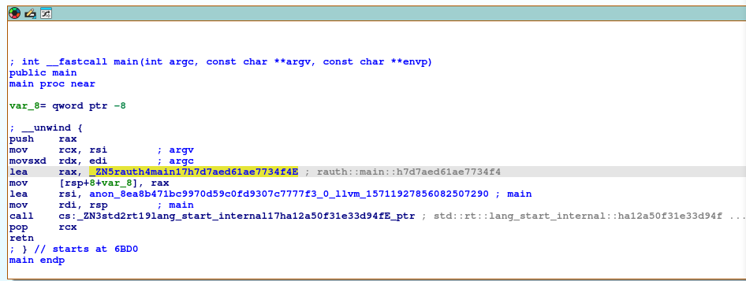
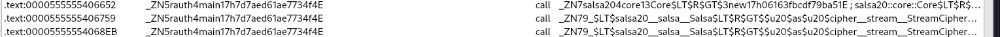

# 🧬 Hack The Box - Reversing Challenge Write-Up:[RAuth] – [11/05/2025]
***

## 🕵️‍♂️ Challenge Overview
- **Objective:** retrieve the HTB flag
- **Link to the challenge:** https://app.hackthebox.com/challenges/RAuth
- **Challenge Description:** My implementation of authentication mechanisms in C turned out to be failures. But my implementation in Rust is unbreakable. Can you retrieve my password?
- **Difficulty:** Easy
- **📦 Provided Files**:
	- File: `RAuth.zip`  
	- Password: `hackthebox`
	- SHA256: `f1aed9e5fc48b3a9eca2d722e574c2ae16aafdda2d4ae87c05622edfd7e94d63`
- **Provided Host:** `94.237.50.173:55871`
- **📦 Extracted Files**:
	-  File: `challenge/rauth`
	- SHA256: `825465157cc9f286adfc4f3d2a910b1267b2dbab5716bdfce72817f7f6f81d99`
---

## ⚙️ Environment Setup
- **Operating System:** `Kali Linux`
- **Tools Used:**
  - Static: `file`, `sha256sum`, `strings`, `readelf`, `ldd`, `objdump`, `python`
  - Dynamic: `ltrace`, `strace`, `IDA Free`, `nc`

---

## 🔍 Static Analysis

#### Initial Observations

Request to http://94.237.50.173:55871
```http
GET / HTTP/1.1
Host: 94.237.50.173:55871
User-Agent: Mozilla/5.0 (X11; Linux x86_64; rv:128.0) Gecko/20100101 Firefox/128.0
Accept: text/html,application/xhtml+xml,application/xml;q=0.9,*/*;q=0.8
Accept-Language: en-US,en;q=0.5
Accept-Encoding: gzip, deflate
Connection: keep-alive
Upgrade-Insecure-Requests: 1
Priority: u=0, i
```

Response:
```http
Welcome to secure login portal!
Enter the password to access the system: 
You entered a wrong password!
```


- File

```bash
file rauth
rauth: ELF 64-bit LSB pie executable, x86-64, version 1 (SYSV), dynamically linked, interpreter /lib64/ld-linux-x86-64.so.2, for GNU/Linux 3.2.0, BuildID[sha1]=fc374b8206147fac9067599050989191b39eefcf, with debug_info, not stripped
```

- ldd

```bash
ldd rauth 
        linux-vdso.so.1 (0x00007ffe0c9db000)
        libdl.so.2 => /lib/x86_64-linux-gnu/libdl.so.2 (0x00007f1db9629000)
        librt.so.1 => /lib/x86_64-linux-gnu/librt.so.1 (0x00007f1db9624000)
        libpthread.so.0 => /lib/x86_64-linux-gnu/libpthread.so.0 (0x00007f1db961f000)
        libgcc_s.so.1 => /lib/x86_64-linux-gnu/libgcc_s.so.1 (0x00007f1db95f2000)
        libc.so.6 => /lib/x86_64-linux-gnu/libc.so.6 (0x00007f1db900a000)
        /lib64/ld-linux-x86-64.so.2 (0x00007f1db9649000)
```

Only standard C libs plus pthread, rt, dl—no heavyweight crypto libraries.

- strings

```bash
there are so many strings that it's almost impossible to understand something in that caos.
```

💻 Dynamic Analysis

I'll carry out an initial execution test to observe the standard behaviour.

```bash
./rauth 
Welcome to secure login portal!
Enter the password to access the system: 
hola
You entered a wrong password!
```

It appears to behave the same way as what we see on the host-provided page.

💻 Static Analysis  
Let’s check if any of these strings are hardcoded:

```bash
strings -a rauth | grep 'password'
src/main.rsYou entered a wrong password!
Enter the password to access the system: 

strings -a rauth | grep 'Welcome'
Welcome to secure login portal!
```

Yes, we can. So I'll try to remember this string and trace its references in the code to help locate the key section when we disassemble it later.

- objdump

```bash
objdump -af rauth  

rauth:     file format elf64-x86-64
rauth
architecture: i386:x86-64, flags 0x00000150:
HAS_SYMS, DYNAMIC, D_PAGED
start address 0x0000000000005510
```

- readelf

```bash
readelf -a rauth                    
ELF Header:
  Magic:   7f 45 4c 46 02 01 01 00 00 00 00 00 00 00 00 00 
  Class:                             ELF64
  Data:                              2's complement, little endian
  Version:                           1 (current)
  OS/ABI:                            UNIX - System V
  ABI Version:                       0
  Type:                              DYN (Position-Independent Executable file)
  Machine:                           Advanced Micro Devices X86-64
  Version:                           0x1
  Entry point address:               0x5510
  Start of program headers:          64 (bytes into file)
  Start of section headers:          10411312 (bytes into file)
  Flags:                             0x0
  Size of this header:               64 (bytes)
  Size of program headers:           56 (bytes)
  Number of program headers:         10
  Size of section headers:           64 (bytes)
  Number of section headers:         42
  Section header string table index: 41

Section Headers:
  [Nr] Name              Type             Address           Offset
       Size              EntSize          Flags  Link  Info  Align
  [ 0]                   NULL             0000000000000000  00000000
       0000000000000000  0000000000000000           0     0     0
  [ 1] .interp           PROGBITS         0000000000000270  00000270
       000000000000001c  0000000000000000   A       0     0     1
  [ 2] .note.ABI-tag     NOTE             000000000000028c  0000028c
       0000000000000020  0000000000000000   A       0     0     4
  [ 3] .note.gnu.bu[...] NOTE             00000000000002ac  000002ac
       0000000000000024  0000000000000000   A       0     0     4
  [ 4] .gnu.hash         GNU_HASH         00000000000002d0  000002d0
       000000000000001c  0000000000000000   A       5     0     8
  [ 5] .dynsym           DYNSYM           00000000000002f0  000002f0
       0000000000000738  0000000000000018   A       6     1     8
  [ 6] .dynstr           STRTAB           0000000000000a28  00000a28
       000000000000053d  0000000000000000   A       0     0     1
  [ 7] .gnu.version      VERSYM           0000000000000f66  00000f66
       000000000000009a  0000000000000002   A       5     0     2
  [ 8] .gnu.version_r    VERNEED          0000000000001000  00001000
       00000000000000f0  0000000000000000   A       6     4     8
  [ 9] .rela.dyn         RELA             00000000000010f0  000010f0
       0000000000004368  0000000000000018   A       5     0     8
  [10] .rela.plt         RELA             0000000000005458  00005458
       0000000000000048  0000000000000018  AI       5    25     8
  [11] .init             PROGBITS         00000000000054a0  000054a0
       0000000000000017  0000000000000000  AX       0     0     4
  [12] .plt              PROGBITS         00000000000054c0  000054c0
       0000000000000040  0000000000000010  AX       0     0     16
  [13] .plt.got          PROGBITS         0000000000005500  00005500
       0000000000000008  0000000000000008  AX       0     0     8
  [14] .text             PROGBITS         0000000000005510  00005510
       00000000000346bf  0000000000000000  AX       0     0     16
  [15] .fini             PROGBITS         0000000000039bd0  00039bd0
       0000000000000009  0000000000000000  AX       0     0     4
  [16] .rodata           PROGBITS         0000000000039be0  00039be0
       0000000000004b7d  0000000000000000   A       0     0     16
  [17] .eh_frame_hdr     PROGBITS         000000000003e760  0003e760
       00000000000012c4  0000000000000000   A       0     0     4
  [18] .eh_frame         PROGBITS         000000000003fa28  0003fa28
       0000000000006618  0000000000000000   A       0     0     8
  [19] .gcc_except_table PROGBITS         0000000000046040  00046040
       000000000000230c  0000000000000000   A       0     0     4
  [20] .tbss             NOBITS           0000000000249060  00049060
       00000000000000b8  0000000000000000 WAT       0     0     32
  [21] .init_array       INIT_ARRAY       0000000000249060  00049060
       0000000000000010  0000000000000008  WA       0     0     8
  [22] .fini_array       FINI_ARRAY       0000000000249070  00049070
       0000000000000008  0000000000000008  WA       0     0     8
  [23] .data.rel.ro      PROGBITS         0000000000249078  00049078
       00000000000026c0  0000000000000000  WA       0     0     8
  [24] .dynamic          DYNAMIC          000000000024b738  0004b738
       0000000000000240  0000000000000010  WA       6     0     8
  [25] .got              PROGBITS         000000000024b978  0004b978
       0000000000000678  0000000000000008  WA       0     0     8
  [26] .data             PROGBITS         000000000024c000  0004c000
       0000000000000031  0000000000000000  WA       0     0     8
  [27] .bss              NOBITS           000000000024c038  0004c031
       0000000000000218  0000000000000000  WA       0     0     8
  [28] .comment          PROGBITS         0000000000000000  0004c031
       0000000000000029  0000000000000001  MS       0     0     1
  [29] .debug_aranges    PROGBITS         0000000000000000  0004c05a
       000000000000f280  0000000000000000           0     0     1
  [30] .debug_pubnames   PROGBITS         0000000000000000  0005b2da
       000000000008c319  0000000000000000           0     0     1
  [31] .debug_info       PROGBITS         0000000000000000  000e75f3
       00000000002b732e  0000000000000000           0     0     1
  [32] .debug_abbrev     PROGBITS         0000000000000000  0039e921
       000000000000b2ad  0000000000000000           0     0     1
  [33] .debug_line       PROGBITS         0000000000000000  003a9bce
       000000000007fc1c  0000000000000000           0     0     1
  [34] .debug_frame      PROGBITS         0000000000000000  004297f0
       00000000000001f0  0000000000000000           0     0     8
  [35] .debug_str        PROGBITS         0000000000000000  004299e0
       000000000011c502  0000000000000001  MS       0     0     1
  [36] .debug_loc        PROGBITS         0000000000000000  00545ee2
       0000000000309fbd  0000000000000000           0     0     1
  [37] .debug_pubtypes   PROGBITS         0000000000000000  0084fe9f
       00000000000af584  0000000000000000           0     0     1
  [38] .debug_ranges     PROGBITS         0000000000000000  008ff423
       00000000000d57c0  0000000000000000           0     0     1
  [39] .symtab           SYMTAB           0000000000000000  009d4be8
       0000000000008730  0000000000000018          40   883     8
  [40] .strtab           STRTAB           0000000000000000  009dd318
       0000000000010869  0000000000000000           0     0     1
  [41] .shstrtab         STRTAB           0000000000000000  009edb81
       00000000000001a9  0000000000000000           0     0     1
Key to Flags:
  W (write), A (alloc), X (execute), M (merge), S (strings), I (info),
  L (link order), O (extra OS processing required), G (group), T (TLS),
  C (compressed), x (unknown), o (OS specific), E (exclude),
  D (mbind), l (large), p (processor specific)

There are no section groups in this file.

Program Headers:
  Type           Offset             VirtAddr           PhysAddr
                 FileSiz            MemSiz              Flags  Align
  PHDR           0x0000000000000040 0x0000000000000040 0x0000000000000040
                 0x0000000000000230 0x0000000000000230  R      0x8
  INTERP         0x0000000000000270 0x0000000000000270 0x0000000000000270
                 0x000000000000001c 0x000000000000001c  R      0x1
      [Requesting program interpreter: /lib64/ld-linux-x86-64.so.2]
  LOAD           0x0000000000000000 0x0000000000000000 0x0000000000000000
                 0x000000000004834c 0x000000000004834c  R E    0x200000
  LOAD           0x0000000000049060 0x0000000000249060 0x0000000000249060
                 0x0000000000002fd1 0x00000000000031f0  RW     0x200000
  DYNAMIC        0x000000000004b738 0x000000000024b738 0x000000000024b738
                 0x0000000000000240 0x0000000000000240  RW     0x8
  NOTE           0x000000000000028c 0x000000000000028c 0x000000000000028c
                 0x0000000000000044 0x0000000000000044  R      0x4
  TLS            0x0000000000049060 0x0000000000249060 0x0000000000249060
                 0x0000000000000000 0x00000000000000b8  R      0x20
  GNU_EH_FRAME   0x000000000003e760 0x000000000003e760 0x000000000003e760
                 0x00000000000012c4 0x00000000000012c4  R      0x4
  GNU_STACK      0x0000000000000000 0x0000000000000000 0x0000000000000000
                 0x0000000000000000 0x0000000000000000  RW     0x10
  GNU_RELRO      0x0000000000049060 0x0000000000249060 0x0000000000249060
                 0x0000000000002fa0 0x0000000000002fa0  R      0x1

 Section to Segment mapping:
  Segment Sections...
   00     
   01     .interp 
   02     .interp .note.ABI-tag .note.gnu.build-id .gnu.hash .dynsym .dynstr .gnu.version .gnu.version_r .rela.dyn .rela.plt .init .plt .plt.got .text .fini .rodata .eh_frame_hdr .eh_frame .gcc_except_table 
   03     .init_array .fini_array .data.rel.ro .dynamic .got .data .bss 
   04     .dynamic 
   05     .note.ABI-tag .note.gnu.build-id 
   06     .tbss 
   07     .eh_frame_hdr 
   08     
   09     .init_array .fini_array .data.rel.ro .dynamic .got 

Dynamic section at offset 0x4b738 contains 32 entries:
  Tag        Type                         Name/Value
 0x0000000000000001 (NEEDED)             Shared library: [libdl.so.2]
 0x0000000000000001 (NEEDED)             Shared library: [librt.so.1]
 0x0000000000000001 (NEEDED)             Shared library: [libpthread.so.0]
 0x0000000000000001 (NEEDED)             Shared library: [libgcc_s.so.1]
 0x0000000000000001 (NEEDED)             Shared library: [libc.so.6]
 0x0000000000000001 (NEEDED)             Shared library: [ld-linux-x86-64.so.2]
 0x000000000000000c (INIT)               0x54a0
 0x000000000000000d (FINI)               0x39bd0
 0x0000000000000019 (INIT_ARRAY)         0x249060
 0x000000000000001b (INIT_ARRAYSZ)       16 (bytes)
 0x000000000000001a (FINI_ARRAY)         0x249070
 0x000000000000001c (FINI_ARRAYSZ)       8 (bytes)
 0x000000006ffffef5 (GNU_HASH)           0x2d0
 0x0000000000000005 (STRTAB)             0xa28
 0x0000000000000006 (SYMTAB)             0x2f0
 0x000000000000000a (STRSZ)              1341 (bytes)
 0x000000000000000b (SYMENT)             24 (bytes)
 0x0000000000000015 (DEBUG)              0x0
 0x0000000000000003 (PLTGOT)             0x24b978
 0x0000000000000002 (PLTRELSZ)           72 (bytes)
 0x0000000000000014 (PLTREL)             RELA
 0x0000000000000017 (JMPREL)             0x5458
 0x0000000000000007 (RELA)               0x10f0
 0x0000000000000008 (RELASZ)             17256 (bytes)
 0x0000000000000009 (RELAENT)            24 (bytes)
 0x000000000000001e (FLAGS)              BIND_NOW
 0x000000006ffffffb (FLAGS_1)            Flags: NOW PIE
 0x000000006ffffffe (VERNEED)            0x1000
 0x000000006fffffff (VERNEEDNUM)         4
 0x000000006ffffff0 (VERSYM)             0xf66
 0x000000006ffffff9 (RELACOUNT)          646
 0x0000000000000000 (NULL)               0x0

Relocation section '.rela.dyn' at offset 0x10f0 contains 719 entries:
  Offset          Info           Type           Sym. Value    Sym. Name + Addend
000000249060  000000000008 R_X86_64_RELATIVE                    b0a0
000000249068  000000000008 R_X86_64_RELATIVE                    5610
000000249070  000000000008 R_X86_64_RELATIVE                    55d0
000000249078  000000000008 R_X86_64_RELATIVE                    39be0
000000249090  000000000008 R_X86_64_RELATIVE                    5cf0
...
...
and many more relocations...
...
...

00000024b9b8  000100000006 R_X86_64_GLOB_DAT 0000000000000000 pthread_getattr_np@GLIBC_2.2.5 + 0
00000024b9c8  000200000006 R_X86_64_GLOB_DAT 0000000000000000 mprotect@GLIBC_2.2.5 + 0
00000024b9d0  000300000006 R_X86_64_GLOB_DAT 0000000000000000 pthread_getspecific@GLIBC_2.2.5 + 0
00000024b9d8  000400000006 R_X86_64_GLOB_DAT 0000000000000000 pthread_cond_destroy@GLIBC_2.3.2 + 0
00000024ba10  000500000006 R_X86_64_GLOB_DAT 0000000000000000 _Unwind_GetRegionStart@GCC_3.0 + 0
00000024ba18  000600000006 R_X86_64_GLOB_DAT 0000000000000000 memset@GLIBC_2.2.5 + 0
00000024ba40  000700000006 R_X86_64_GLOB_DAT 0000000000000000 _Unwind_SetGR@GCC_3.0 + 0
00000024ba48  000800000006 R_X86_64_GLOB_DAT 0000000000000000 posix_memalign@GLIBC_2.2.5 + 0
00000024ba58  000900000006 R_X86_64_GLOB_DAT 0000000000000000 close@GLIBC_2.2.5 + 0
00000024ba60  000a00000006 R_X86_64_GLOB_DAT 0000000000000000 _Unwind_GetDataRelBase@GCC_3.0 + 0
00000024ba80  000b00000006 R_X86_64_GLOB_DAT 0000000000000000 abort@GLIBC_2.2.5 + 0
00000024ba90  000c00000006 R_X86_64_GLOB_DAT 0000000000000000 pthread_setspecific@GLIBC_2.2.5 + 0
00000024ba98  000d00000006 R_X86_64_GLOB_DAT 0000000000000000 memchr@GLIBC_2.2.5 + 0
00000024bac8  000e00000006 R_X86_64_GLOB_DAT 0000000000000000 __gmon_start__ + 0
00000024bad8  000f00000006 R_X86_64_GLOB_DAT 0000000000000000 pthread_cond_signal@GLIBC_2.3.2 + 0
00000024bae8  001000000006 R_X86_64_GLOB_DAT 0000000000000000 pthread_mutexattr[...]@GLIBC_2.2.5 + 0
00000024bb20  001100000006 R_X86_64_GLOB_DAT 0000000000000000 read@GLIBC_2.2.5 + 0
00000024bb28  001200000006 R_X86_64_GLOB_DAT 0000000000000000 malloc@GLIBC_2.2.5 + 0
00000024bb30  001300000006 R_X86_64_GLOB_DAT 0000000000000000 __libc_start_main@GLIBC_2.2.5 + 0
00000024bb80  001400000006 R_X86_64_GLOB_DAT 0000000000000000 sysconf@GLIBC_2.2.5 + 0
00000024bb88  001500000006 R_X86_64_GLOB_DAT 0000000000000000 pthread_mutex_init@GLIBC_2.2.5 + 0
00000024bb98  001600000006 R_X86_64_GLOB_DAT 0000000000000000 pthread_attr_destroy@GLIBC_2.2.5 + 0
00000024bbd0  001800000006 R_X86_64_GLOB_DAT 0000000000000000 _ITM_deregisterTM[...] + 0
00000024bbe8  001900000006 R_X86_64_GLOB_DAT 0000000000000000 _Unwind_GetLangua[...]@GCC_3.0 + 0
00000024bc18  001a00000006 R_X86_64_GLOB_DAT 0000000000000000 free@GLIBC_2.2.5 + 0
00000024bc38  001b00000006 R_X86_64_GLOB_DAT 0000000000000000 strlen@GLIBC_2.2.5 + 0
00000024bc48  001c00000006 R_X86_64_GLOB_DAT 0000000000000000 _ITM_registerTMCl[...] + 0
00000024bc68  001d00000006 R_X86_64_GLOB_DAT 0000000000000000 __cxa_thread_atex[...]@GLIBC_2.18 + 0
00000024bc70  001e00000006 R_X86_64_GLOB_DAT 0000000000000000 pthread_cond_init@GLIBC_2.3.2 + 0
00000024bc88  001f00000006 R_X86_64_GLOB_DAT 0000000000000000 _Unwind_RaiseException@GCC_3.0 + 0
00000024bca8  002000000006 R_X86_64_GLOB_DAT 0000000000000000 __cxa_finalize@GLIBC_2.2.5 + 0
00000024bcb0  002100000006 R_X86_64_GLOB_DAT 0000000000000000 pthread_key_delete@GLIBC_2.2.5 + 0
00000024bcd0  002300000006 R_X86_64_GLOB_DAT 0000000000000000 syscall@GLIBC_2.2.5 + 0
00000024bce0  002400000006 R_X86_64_GLOB_DAT 0000000000000000 _Unwind_GetIP@GCC_3.0 + 0
00000024bce8  002500000006 R_X86_64_GLOB_DAT 0000000000000000 _Unwind_Backtrace@GCC_3.3 + 0
00000024bd10  002600000006 R_X86_64_GLOB_DAT 0000000000000000 pthread_attr_getstack@GLIBC_2.2.5 + 0
00000024bd20  002700000006 R_X86_64_GLOB_DAT 0000000000000000 pthread_self@GLIBC_2.2.5 + 0
00000024bd50  002800000006 R_X86_64_GLOB_DAT 0000000000000000 open64@GLIBC_2.2.5 + 0
00000024bd58  002900000006 R_X86_64_GLOB_DAT 0000000000000000 sigaction@GLIBC_2.2.5 + 0
00000024bd68  002a00000006 R_X86_64_GLOB_DAT 0000000000000000 bcmp@GLIBC_2.2.5 + 0
00000024bd70  002b00000006 R_X86_64_GLOB_DAT 0000000000000000 memrchr@GLIBC_2.2.5 + 0
00000024bd88  002c00000006 R_X86_64_GLOB_DAT 0000000000000000 readlink@GLIBC_2.2.5 + 0
00000024bdb0  002d00000006 R_X86_64_GLOB_DAT 0000000000000000 signal@GLIBC_2.2.5 + 0
00000024bdc0  002e00000006 R_X86_64_GLOB_DAT 0000000000000000 memmove@GLIBC_2.2.5 + 0
00000024bde0  002f00000006 R_X86_64_GLOB_DAT 0000000000000000 getenv@GLIBC_2.2.5 + 0
00000024bde8  003000000006 R_X86_64_GLOB_DAT 0000000000000000 _Unwind_GetIPInfo@GCC_4.2.0 + 0
00000024bdf0  003100000006 R_X86_64_GLOB_DAT 0000000000000000 pthread_condattr_init@GLIBC_2.2.5 + 0
00000024bdf8  003200000006 R_X86_64_GLOB_DAT 0000000000000000 dl_iterate_phdr@GLIBC_2.2.5 + 0
00000024be00  003300000006 R_X86_64_GLOB_DAT 0000000000000000 __errno_location@GLIBC_2.2.5 + 0
00000024be18  003400000006 R_X86_64_GLOB_DAT 0000000000000000 pthread_mutexattr[...]@GLIBC_2.2.5 + 0
00000024be20  003500000006 R_X86_64_GLOB_DAT 0000000000000000 pthread_condattr_[...]@GLIBC_2.2.5 + 0
00000024be28  003600000006 R_X86_64_GLOB_DAT 0000000000000000 pthread_condattr_[...]@GLIBC_2.3.3 + 0
00000024be38  003700000006 R_X86_64_GLOB_DAT 0000000000000000 getcwd@GLIBC_2.2.5 + 0
00000024be70  003800000006 R_X86_64_GLOB_DAT 0000000000000000 pthread_rwlock_rdlock@GLIBC_2.2.5 + 0
00000024be88  003900000006 R_X86_64_GLOB_DAT 0000000000000000 pthread_cond_wait@GLIBC_2.3.2 + 0
00000024bea0  003a00000006 R_X86_64_GLOB_DAT 0000000000000000 calloc@GLIBC_2.2.5 + 0
00000024bea8  003b00000006 R_X86_64_GLOB_DAT 0000000000000000 munmap@GLIBC_2.2.5 + 0
00000024beb0  003c00000006 R_X86_64_GLOB_DAT 0000000000000000 __xpg_strerror_r@GLIBC_2.3.4 + 0
00000024beb8  003d00000006 R_X86_64_GLOB_DAT 0000000000000000 writev@GLIBC_2.2.5 + 0
00000024bee8  003e00000006 R_X86_64_GLOB_DAT 0000000000000000 pthread_attr_init@GLIBC_2.2.5 + 0
00000024bf10  003f00000006 R_X86_64_GLOB_DAT 0000000000000000 _Unwind_GetTextRelBase@GCC_3.0 + 0
00000024bf40  004000000006 R_X86_64_GLOB_DAT 0000000000000000 pthread_rwlock_unlock@GLIBC_2.2.5 + 0
00000024bf48  004100000006 R_X86_64_GLOB_DAT 0000000000000000 pthread_mutex_lock@GLIBC_2.2.5 + 0
00000024bf50  004200000006 R_X86_64_GLOB_DAT 0000000000000000 realloc@GLIBC_2.2.5 + 0
00000024bf58  004300000006 R_X86_64_GLOB_DAT 0000000000000000 pthread_mutexattr_init@GLIBC_2.2.5 + 0
00000024bf60  004400000006 R_X86_64_GLOB_DAT 0000000000000000 pthread_key_create@GLIBC_2.2.5 + 0
00000024bf70  004500000006 R_X86_64_GLOB_DAT 0000000000000000 pthread_mutex_destroy@GLIBC_2.2.5 + 0
00000024bf80  004600000006 R_X86_64_GLOB_DAT 0000000000000000 write@GLIBC_2.2.5 + 0
00000024bf98  004800000006 R_X86_64_GLOB_DAT 0000000000000000 sigaltstack@GLIBC_2.2.5 + 0
00000024bfa0  004900000006 R_X86_64_GLOB_DAT 0000000000000000 pthread_mutex_unlock@GLIBC_2.2.5 + 0
00000024bfa8  004a00000006 R_X86_64_GLOB_DAT 0000000000000000 memcpy@GLIBC_2.14 + 0
00000024bfc0  004b00000006 R_X86_64_GLOB_DAT 0000000000000000 mmap@GLIBC_2.2.5 + 0
00000024bfc8  004c00000006 R_X86_64_GLOB_DAT 0000000000000000 _Unwind_SetIP@GCC_3.0 + 0

Relocation section '.rela.plt' at offset 0x5458 contains 3 entries:
  Offset          Info           Type           Sym. Value    Sym. Name + Addend
00000024b990  001700000007 R_X86_64_JUMP_SLO 0000000000000000 __fxstat64@GLIBC_2.2.5 + 0
00000024b998  002200000007 R_X86_64_JUMP_SLO 0000000000000000 __tls_get_addr@GLIBC_2.3 + 0
00000024b9a0  004700000007 R_X86_64_JUMP_SLO 0000000000000000 _Unwind_Resume@GCC_3.0 + 0
No processor specific unwind information to decode

Symbol table '.dynsym' contains 77 entries:
   Num:    Value          Size Type    Bind   Vis      Ndx Name
     0: 0000000000000000     0 NOTYPE  LOCAL  DEFAULT  UND 
     1: 0000000000000000     0 FUNC    GLOBAL DEFAULT  UND [...]@GLIBC_2.2.5 (2)
     2: 0000000000000000     0 FUNC    GLOBAL DEFAULT  UND [...]@GLIBC_2.2.5 (3)
     3: 0000000000000000     0 FUNC    GLOBAL DEFAULT  UND [...]@GLIBC_2.2.5 (2)
     4: 0000000000000000     0 FUNC    GLOBAL DEFAULT  UND [...]@GLIBC_2.3.2 (4)
     5: 0000000000000000     0 FUNC    GLOBAL DEFAULT  UND _Unw[...]@GCC_3.0 (5)
     6: 0000000000000000     0 FUNC    GLOBAL DEFAULT  UND [...]@GLIBC_2.2.5 (3)
     7: 0000000000000000     0 FUNC    GLOBAL DEFAULT  UND _Unw[...]@GCC_3.0 (5)
     8: 0000000000000000     0 FUNC    GLOBAL DEFAULT  UND [...]@GLIBC_2.2.5 (3)
     9: 0000000000000000     0 FUNC    GLOBAL DEFAULT  UND close@GLIBC_2.2.5 (2)
    10: 0000000000000000     0 FUNC    GLOBAL DEFAULT  UND _Unw[...]@GCC_3.0 (5)
    11: 0000000000000000     0 FUNC    GLOBAL DEFAULT  UND abort@GLIBC_2.2.5 (3)
    12: 0000000000000000     0 FUNC    GLOBAL DEFAULT  UND [...]@GLIBC_2.2.5 (2)
    13: 0000000000000000     0 FUNC    GLOBAL DEFAULT  UND [...]@GLIBC_2.2.5 (3)
    14: 0000000000000000     0 NOTYPE  WEAK   DEFAULT  UND __gmon_start__
    15: 0000000000000000     0 FUNC    GLOBAL DEFAULT  UND [...]@GLIBC_2.3.2 (4)
    16: 0000000000000000     0 FUNC    GLOBAL DEFAULT  UND [...]@GLIBC_2.2.5 (2)
    17: 0000000000000000     0 FUNC    GLOBAL DEFAULT  UND read@GLIBC_2.2.5 (2)
    18: 0000000000000000     0 FUNC    GLOBAL DEFAULT  UND [...]@GLIBC_2.2.5 (3)
    19: 0000000000000000     0 FUNC    GLOBAL DEFAULT  UND [...]@GLIBC_2.2.5 (3)
    20: 0000000000000000     0 FUNC    GLOBAL DEFAULT  UND [...]@GLIBC_2.2.5 (3)
    21: 0000000000000000     0 FUNC    GLOBAL DEFAULT  UND [...]@GLIBC_2.2.5 (2)
    22: 0000000000000000     0 FUNC    GLOBAL DEFAULT  UND [...]@GLIBC_2.2.5 (2)
    23: 0000000000000000     0 FUNC    GLOBAL DEFAULT  UND [...]@GLIBC_2.2.5 (3)
    24: 0000000000000000     0 NOTYPE  WEAK   DEFAULT  UND _ITM_deregisterT[...]
    25: 0000000000000000     0 FUNC    GLOBAL DEFAULT  UND _Unw[...]@GCC_3.0 (5)
    26: 0000000000000000     0 FUNC    GLOBAL DEFAULT  UND free@GLIBC_2.2.5 (3)
    27: 0000000000000000     0 FUNC    GLOBAL DEFAULT  UND [...]@GLIBC_2.2.5 (3)
    28: 0000000000000000     0 NOTYPE  WEAK   DEFAULT  UND _ITM_registerTMC[...]
    29: 0000000000000000     0 FUNC    WEAK   DEFAULT  UND _[...]@GLIBC_2.18 (6)
    30: 0000000000000000     0 FUNC    GLOBAL DEFAULT  UND [...]@GLIBC_2.3.2 (4)
    31: 0000000000000000     0 FUNC    GLOBAL DEFAULT  UND _Unw[...]@GCC_3.0 (5)
    32: 0000000000000000     0 FUNC    WEAK   DEFAULT  UND [...]@GLIBC_2.2.5 (3)
    33: 0000000000000000     0 FUNC    GLOBAL DEFAULT  UND [...]@GLIBC_2.2.5 (2)
    34: 0000000000000000     0 FUNC    GLOBAL DEFAULT  UND __[...]@GLIBC_2.3 (7)
    35: 0000000000000000     0 FUNC    GLOBAL DEFAULT  UND [...]@GLIBC_2.2.5 (3)
    36: 0000000000000000     0 FUNC    GLOBAL DEFAULT  UND _Unw[...]@GCC_3.0 (5)
    37: 0000000000000000     0 FUNC    GLOBAL DEFAULT  UND _Unw[...]@GCC_3.3 (8)
    38: 0000000000000000     0 FUNC    GLOBAL DEFAULT  UND [...]@GLIBC_2.2.5 (2)
    39: 0000000000000000     0 FUNC    GLOBAL DEFAULT  UND [...]@GLIBC_2.2.5 (3)
    40: 0000000000000000     0 FUNC    GLOBAL DEFAULT  UND [...]@GLIBC_2.2.5 (2)
    41: 0000000000000000     0 FUNC    GLOBAL DEFAULT  UND [...]@GLIBC_2.2.5 (2)
    42: 0000000000000000     0 FUNC    GLOBAL DEFAULT  UND bcmp@GLIBC_2.2.5 (3)
    43: 0000000000000000     0 FUNC    GLOBAL DEFAULT  UND [...]@GLIBC_2.2.5 (3)
    44: 0000000000000000     0 FUNC    GLOBAL DEFAULT  UND [...]@GLIBC_2.2.5 (3)
    45: 0000000000000000     0 FUNC    GLOBAL DEFAULT  UND [...]@GLIBC_2.2.5 (3)
    46: 0000000000000000     0 FUNC    GLOBAL DEFAULT  UND [...]@GLIBC_2.2.5 (3)
    47: 0000000000000000     0 FUNC    GLOBAL DEFAULT  UND [...]@GLIBC_2.2.5 (3)
    48: 0000000000000000     0 FUNC    GLOBAL DEFAULT  UND _U[...]@GCC_4.2.0 (9)
    49: 0000000000000000     0 FUNC    GLOBAL DEFAULT  UND [...]@GLIBC_2.2.5 (2)
    50: 0000000000000000     0 FUNC    GLOBAL DEFAULT  UND [...]@GLIBC_2.2.5 (3)
    51: 0000000000000000     0 FUNC    GLOBAL DEFAULT  UND [...]@GLIBC_2.2.5 (2)
    52: 0000000000000000     0 FUNC    GLOBAL DEFAULT  UND [...]@GLIBC_2.2.5 (2)
    53: 0000000000000000     0 FUNC    GLOBAL DEFAULT  UND [...]@GLIBC_2.2.5 (2)
    54: 0000000000000000     0 FUNC    GLOBAL DEFAULT  UND [...]@GLIBC_2.3.3 (10)
    55: 0000000000000000     0 FUNC    GLOBAL DEFAULT  UND [...]@GLIBC_2.2.5 (3)
    56: 0000000000000000     0 FUNC    GLOBAL DEFAULT  UND [...]@GLIBC_2.2.5 (2)
    57: 0000000000000000     0 FUNC    GLOBAL DEFAULT  UND [...]@GLIBC_2.3.2 (4)
    58: 0000000000000000     0 FUNC    GLOBAL DEFAULT  UND [...]@GLIBC_2.2.5 (3)
    59: 0000000000000000     0 FUNC    GLOBAL DEFAULT  UND [...]@GLIBC_2.2.5 (3)
    60: 0000000000000000     0 FUNC    GLOBAL DEFAULT  UND [...]@GLIBC_2.3.4 (11)
    61: 0000000000000000     0 FUNC    GLOBAL DEFAULT  UND [...]@GLIBC_2.2.5 (3)
    62: 0000000000000000     0 FUNC    GLOBAL DEFAULT  UND [...]@GLIBC_2.2.5 (2)
    63: 0000000000000000     0 FUNC    GLOBAL DEFAULT  UND _Unw[...]@GCC_3.0 (5)
    64: 0000000000000000     0 FUNC    GLOBAL DEFAULT  UND [...]@GLIBC_2.2.5 (2)
    65: 0000000000000000     0 FUNC    GLOBAL DEFAULT  UND [...]@GLIBC_2.2.5 (2)
    66: 0000000000000000     0 FUNC    GLOBAL DEFAULT  UND [...]@GLIBC_2.2.5 (3)
    67: 0000000000000000     0 FUNC    GLOBAL DEFAULT  UND [...]@GLIBC_2.2.5 (2)
    68: 0000000000000000     0 FUNC    GLOBAL DEFAULT  UND [...]@GLIBC_2.2.5 (2)
    69: 0000000000000000     0 FUNC    GLOBAL DEFAULT  UND [...]@GLIBC_2.2.5 (2)
    70: 0000000000000000     0 FUNC    GLOBAL DEFAULT  UND write@GLIBC_2.2.5 (2)
    71: 0000000000000000     0 FUNC    GLOBAL DEFAULT  UND _Unw[...]@GCC_3.0 (5)
    72: 0000000000000000     0 FUNC    GLOBAL DEFAULT  UND [...]@GLIBC_2.2.5 (3)
    73: 0000000000000000     0 FUNC    GLOBAL DEFAULT  UND [...]@GLIBC_2.2.5 (2)
    74: 0000000000000000     0 FUNC    GLOBAL DEFAULT  UND [...]@GLIBC_2.14 (12)
    75: 0000000000000000     0 FUNC    GLOBAL DEFAULT  UND mmap@GLIBC_2.2.5 (3)
    76: 0000000000000000     0 FUNC    GLOBAL DEFAULT  UND _Unw[...]@GCC_3.0 (5)

Symbol table '.symtab' contains 1442 entries:
   Num:    Value          Size Type    Bind   Vis      Ndx Name
     0: 0000000000000000     0 NOTYPE  LOCAL  DEFAULT  UND 
     1: 0000000000000270     0 SECTION LOCAL  DEFAULT    1 .interp
     2: 000000000000028c     0 SECTION LOCAL  DEFAULT    2 .note.ABI-tag
     3: 00000000000002ac     0 SECTION LOCAL  DEFAULT    3 .note.gnu.build-id
     4: 00000000000002d0     0 SECTION LOCAL  DEFAULT    4 .gnu.hash
     5: 00000000000002f0     0 SECTION LOCAL  DEFAULT    5 .dynsym
     6: 0000000000000a28     0 SECTION LOCAL  DEFAULT    6 .dynstr
     7: 0000000000000f66     0 SECTION LOCAL  DEFAULT    7 .gnu.version
     8: 0000000000001000     0 SECTION LOCAL  DEFAULT    8 .gnu.version_r
     9: 00000000000010f0     0 SECTION LOCAL  DEFAULT    9 .rela.dyn
    10: 0000000000005458     0 SECTION LOCAL  DEFAULT   10 .rela.plt
    11: 00000000000054a0     0 SECTION LOCAL  DEFAULT   11 .init
    12: 00000000000054c0     0 SECTION LOCAL  DEFAULT   12 .plt
    13: 0000000000005500     0 SECTION LOCAL  DEFAULT   13 .plt.got
    14: 0000000000005510     0 SECTION LOCAL  DEFAULT   14 .text
    15: 0000000000039bd0     0 SECTION LOCAL  DEFAULT   15 .fini
    16: 0000000000039be0     0 SECTION LOCAL  DEFAULT   16 .rodata
    17: 000000000003e760     0 SECTION LOCAL  DEFAULT   17 .eh_frame_hdr
    18: 000000000003fa28     0 SECTION LOCAL  DEFAULT   18 .eh_frame
    19: 0000000000046040     0 SECTION LOCAL  DEFAULT   19 .gcc_except_table
    20: 0000000000249060     0 SECTION LOCAL  DEFAULT   20 .tbss
    21: 0000000000249060     0 SECTION LOCAL  DEFAULT   21 .init_array
    22: 0000000000249070     0 SECTION LOCAL  DEFAULT   22 .fini_array
    23: 0000000000249078     0 SECTION LOCAL  DEFAULT   23 .data.rel.ro
    24: 000000000024b738     0 SECTION LOCAL  DEFAULT   24 .dynamic
    25: 000000000024b978     0 SECTION LOCAL  DEFAULT   25 .got
    26: 000000000024c000     0 SECTION LOCAL  DEFAULT   26 .data
    27: 000000000024c038     0 SECTION LOCAL  DEFAULT   27 .bss
    28: 0000000000000000     0 SECTION LOCAL  DEFAULT   28 .comment
    29: 0000000000000000     0 SECTION LOCAL  DEFAULT   29 .debug_aranges
    30: 0000000000000000     0 SECTION LOCAL  DEFAULT   30 .debug_pubnames
    31: 0000000000000000     0 SECTION LOCAL  DEFAULT   31 .debug_info
    32: 0000000000000000     0 SECTION LOCAL  DEFAULT   32 .debug_abbrev
    33: 0000000000000000     0 SECTION LOCAL  DEFAULT   33 .debug_line
    34: 0000000000000000     0 SECTION LOCAL  DEFAULT   34 .debug_frame
    35: 0000000000000000     0 SECTION LOCAL  DEFAULT   35 .debug_str
    36: 0000000000000000     0 SECTION LOCAL  DEFAULT   36 .debug_loc
    37: 0000000000000000     0 SECTION LOCAL  DEFAULT   37 .debug_pubtypes
    38: 0000000000000000     0 SECTION LOCAL  DEFAULT   38 .debug_ranges
    39: 0000000000000000     0 FILE    LOCAL  DEFAULT  ABS crtstuff.c
    40: 0000000000005540     0 FUNC    LOCAL  DEFAULT   14 deregister_tm_clones
    41: 0000000000005580     0 FUNC    LOCAL  DEFAULT   14 register_tm_clones
    42: 00000000000055d0     0 FUNC    LOCAL  DEFAULT   14 __do_global_dtors_aux
    43: 000000000024c038     1 OBJECT  LOCAL  DEFAULT   27 completed.7698
    44: 0000000000249070     0 OBJECT  LOCAL  DEFAULT   22 __do_global_dtor[...]
    45: 0000000000005610     0 FUNC    LOCAL  DEFAULT   14 frame_dummy
    46: 0000000000249068     0 OBJECT  LOCAL  DEFAULT   21 __frame_dummy_in[...]
    47: 0000000000000000     0 FILE    LOCAL  DEFAULT  ABS rauth.a2x040wi-cgu.0
    48: 0000000000000000     0 FILE    LOCAL  DEFAULT  ABS rauth.a2x040wi-cgu.1
    49: 0000000000000000     0 FILE    LOCAL  DEFAULT  ABS rauth.a2x040wi-cgu.10
    50: 0000000000000000     0 FILE    LOCAL  DEFAULT  ABS rauth.a2x040wi-cgu.12
    51: 0000000000000000     0 FILE    LOCAL  DEFAULT  ABS rauth.a2x040wi-cgu.13
    52: 0000000000000000     0 FILE    LOCAL  DEFAULT  ABS rauth.a2x040wi-cgu.2
    53: 0000000000000000     0 FILE    LOCAL  DEFAULT  ABS rauth.a2x040wi-cgu.3
    54: 0000000000046040     0 NOTYPE  LOCAL  DEFAULT   19 GCC_except_table2
    55: 000000000004604c     0 NOTYPE  LOCAL  DEFAULT   19 GCC_except_table7
    56: 0000000000006350    16 FUNC    LOCAL  DEFAULT   14 _ZN4core3ptr13dr[...]
    57: 0000000000006360     1 FUNC    LOCAL  DEFAULT   14 _ZN4core3ptr13dr[...]
    58: 0000000000006370   117 FUNC    LOCAL  DEFAULT   14 _ZN4core3ptr13dr[...]
    59: 00000000000063f0    24 FUNC    LOCAL  DEFAULT   14 _ZN4core3ptr13dr[...]
    60: 0000000000006410    24 FUNC    LOCAL  DEFAULT   14 _ZN4core3ptr13dr[...]
    61: 0000000000006430    16 FUNC    LOCAL  DEFAULT   14 _ZN5alloc5alloc8[...]
    62: 0000000000006440    23 FUNC    LOCAL  DEFAULT   14 _ZN5alloc5alloc8[...]
    63: 0000000000006460  1904 FUNC    LOCAL  DEFAULT   14 _ZN5rauth4main17[...]
    64: 0000000000000000     0 FILE    LOCAL  DEFAULT  ABS rauth.a2x040wi-cgu.5
    65: 0000000000000000     0 FILE    LOCAL  DEFAULT  ABS rauth.a2x040wi-cgu.7
    66: 0000000000000000     0 FILE    LOCAL  DEFAULT  ABS uic8wrodmuj0398
    67: 0000000000000000     0 FILE    LOCAL  DEFAULT  ABS cipher.a5g7tkg4-cgu.0
    68: 0000000000000000     0 FILE    LOCAL  DEFAULT  ABS std.d1x4tbr3-cgu.11
    69: 00000000000460f0     0 NOTYPE  LOCAL  DEFAULT   19 GCC_except_table10
    70: 00000000000460fc     0 NOTYPE  LOCAL  DEFAULT   19 GCC_except_table11
    71: 0000000000046240     0 NOTYPE  LOCAL  DEFAULT   19 GCC_except_table113
    72: 0000000000046254     0 NOTYPE  LOCAL  DEFAULT   19 GCC_except_table114
    73: 0000000000046268     0 NOTYPE  LOCAL  DEFAULT   19 GCC_except_table115
    74: 0000000000046284     0 NOTYPE  LOCAL  DEFAULT   19 GCC_except_table116
    75: 0000000000046298     0 NOTYPE  LOCAL  DEFAULT   19 GCC_except_table117
    76: 00000000000462ac     0 NOTYPE  LOCAL  DEFAULT   19 GCC_except_table118
    77: 00000000000462c8     0 NOTYPE  LOCAL  DEFAULT   19 GCC_except_table119
    78: 00000000000462d4     0 NOTYPE  LOCAL  DEFAULT   19 GCC_except_table120
    79: 00000000000462e0     0 NOTYPE  LOCAL  DEFAULT   19 GCC_except_table121
    80: 00000000000462f8     0 NOTYPE  LOCAL  DEFAULT   19 GCC_except_table122
    81: 0000000000046304     0 NOTYPE  LOCAL  DEFAULT   19 GCC_except_table123
    82: 0000000000046310     0 NOTYPE  LOCAL  DEFAULT   19 GCC_except_table128
    83: 0000000000046320     0 NOTYPE  LOCAL  DEFAULT   19 GCC_except_table129
    84: 000000000004632c     0 NOTYPE  LOCAL  DEFAULT   19 GCC_except_table130
    85: 0000000000046338     0 NOTYPE  LOCAL  DEFAULT   19 GCC_except_table131
    86: 000000000004634c     0 NOTYPE  LOCAL  DEFAULT   19 GCC_except_table132
    87: 0000000000046360     0 NOTYPE  LOCAL  DEFAULT   19 GCC_except_table133
    88: 000000000004637c     0 NOTYPE  LOCAL  DEFAULT   19 GCC_except_table137
    89: 000000000004638c     0 NOTYPE  LOCAL  DEFAULT   19 GCC_except_table138
    90: 000000000004639c     0 NOTYPE  LOCAL  DEFAULT   19 GCC_except_table140
    91: 00000000000463b4     0 NOTYPE  LOCAL  DEFAULT   19 GCC_except_table141
    92: 00000000000463cc     0 NOTYPE  LOCAL  DEFAULT   19 GCC_except_table142
    93: 000000000004641c     0 NOTYPE  LOCAL  DEFAULT   19 GCC_except_table143
    94: 0000000000046108     0 NOTYPE  LOCAL  DEFAULT   19 GCC_except_table15
    95: 0000000000046464     0 NOTYPE  LOCAL  DEFAULT   19 GCC_except_table172
    96: 0000000000046478     0 NOTYPE  LOCAL  DEFAULT   19 GCC_except_table174
    97: 000000000004648c     0 NOTYPE  LOCAL  DEFAULT   19 GCC_except_table194
    98: 0000000000046498     0 NOTYPE  LOCAL  DEFAULT   19 GCC_except_table195
    99: 00000000000464a4     0 NOTYPE  LOCAL  DEFAULT   19 GCC_except_table196
   100: 00000000000464b0     0 NOTYPE  LOCAL  DEFAULT   19 GCC_except_table197
   101: 0000000000046114     0 NOTYPE  LOCAL  DEFAULT   19 GCC_except_table21
   102: 00000000000464bc     0 NOTYPE  LOCAL  DEFAULT   19 GCC_except_table212
   103: 0000000000046120     0 NOTYPE  LOCAL  DEFAULT   19 GCC_except_table26
   104: 000000000004616c     0 NOTYPE  LOCAL  DEFAULT   19 GCC_except_table32
   105: 000000000004617c     0 NOTYPE  LOCAL  DEFAULT   19 GCC_except_table35
   106: 000000000004618c     0 NOTYPE  LOCAL  DEFAULT   19 GCC_except_table36
   107: 000000000004619c     0 NOTYPE  LOCAL  DEFAULT   19 GCC_except_table37
   108: 00000000000461ac     0 NOTYPE  LOCAL  DEFAULT   19 GCC_except_table39
   109: 00000000000460d8     0 NOTYPE  LOCAL  DEFAULT   19 GCC_except_table7
   110: 00000000000461cc     0 NOTYPE  LOCAL  DEFAULT   19 GCC_except_table71
   111: 00000000000460e4     0 NOTYPE  LOCAL  DEFAULT   19 GCC_except_table8
   112: 00000000000461e0     0 NOTYPE  LOCAL  DEFAULT   19 GCC_except_table92
   113: 00000000000461f0     0 NOTYPE  LOCAL  DEFAULT   19 GCC_except_table94
   114: 0000000000046200     0 NOTYPE  LOCAL  DEFAULT   19 GCC_except_table95
   115: 0000000000046210     0 NOTYPE  LOCAL  DEFAULT   19 GCC_except_table96
   116: 0000000000046220     0 NOTYPE  LOCAL  DEFAULT   19 GCC_except_table97
   117: 0000000000046230     0 NOTYPE  LOCAL  DEFAULT   19 GCC_except_table98
   118: 0000000000000040    40 TLS     LOCAL  DEFAULT   20 _ZN3std2io5stdio[...]
   119: 0000000000000000    40 TLS     LOCAL  DEFAULT   20 _ZN3std2io5stdio[...]
   120: 0000000000007f80   271 FUNC    LOCAL  DEFAULT   14 _ZN3std2io5stdio[...]
   121: 000000000024c040    48 OBJECT  LOCAL  DEFAULT   27 _ZN3std2io5stdio[...]
   122: 0000000000008150   326 FUNC    LOCAL  DEFAULT   14 _ZN3std2io5stdio[...]
   123: 000000000024c070    48 OBJECT  LOCAL  DEFAULT   27 _ZN3std2io5stdio[...]
   124: 0000000000006dc0   123 FUNC    LOCAL  DEFAULT   14 _ZN4core3ptr13dr[...]
   125: 0000000000006e40   149 FUNC    LOCAL  DEFAULT   14 _ZN4core3ptr13dr[...]
   126: 0000000000006f60    87 FUNC    LOCAL  DEFAULT   14 _ZN4core3ptr13dr[...]
   127: 0000000000006fc0     9 FUNC    LOCAL  DEFAULT   14 _ZN4core3ptr13dr[...]
   128: 0000000000007000   153 FUNC    LOCAL  DEFAULT   14 _ZN4core3ptr13dr[...]
   129: 00000000000070d0    16 FUNC    LOCAL  DEFAULT   14 _ZN4core3ptr13dr[...]
   130: 00000000000070e0    67 FUNC    LOCAL  DEFAULT   14 _ZN4core3ptr13dr[...]
   131: 0000000000000000     0 FILE    LOCAL  DEFAULT  ABS std.d1x4tbr3-cgu.12
   132: 0000000000000000     0 FILE    LOCAL  DEFAULT  ABS std.d1x4tbr3-cgu.13
   133: 000000000004653c     0 NOTYPE  LOCAL  DEFAULT   19 GCC_except_table106
   134: 0000000000046550     0 NOTYPE  LOCAL  DEFAULT   19 GCC_except_table146
   135: 000000000004655c     0 NOTYPE  LOCAL  DEFAULT   19 GCC_except_table150
   136: 00000000000464d0     0 NOTYPE  LOCAL  DEFAULT   19 GCC_except_table17
   137: 00000000000464dc     0 NOTYPE  LOCAL  DEFAULT   19 GCC_except_table41
   138: 0000000000046528     0 NOTYPE  LOCAL  DEFAULT   19 GCC_except_table77
   139: 0000000000008df0   149 FUNC    LOCAL  DEFAULT   14 _ZN4core3ptr13dr[...]
   140: 0000000000008e90    37 FUNC    LOCAL  DEFAULT   14 _ZN4core3ptr13dr[...]
   141: 0000000000000000     0 FILE    LOCAL  DEFAULT  ABS std.d1x4tbr3-cgu.14
   142: 0000000000046758     0 NOTYPE  LOCAL  DEFAULT   19 GCC_except_table104
   143: 0000000000046598     0 NOTYPE  LOCAL  DEFAULT   19 GCC_except_table13
   144: 00000000000465a4     0 NOTYPE  LOCAL  DEFAULT   19 GCC_except_table21
   145: 00000000000465b0     0 NOTYPE  LOCAL  DEFAULT   19 GCC_except_table38
   146: 00000000000465c8     0 NOTYPE  LOCAL  DEFAULT   19 GCC_except_table39
   147: 00000000000465e0     0 NOTYPE  LOCAL  DEFAULT   19 GCC_except_table40
...
Truncated.
...
   634: 0000000000000000     0 FILE    LOCAL  DEFAULT  ABS rauth.a2x040wi-cgu.9
   635: 0000000000000000     0 FILE    LOCAL  DEFAULT  ABS std.d1x4tbr3-cgu.9
   636: 0000000000000000     0 FILE    LOCAL  DEFAULT  ABS adler.3hanu3gw-cgu.2
   637: 0000000000000000     0 FILE    LOCAL  DEFAULT  ABS object.5bjb62n7-cgu.9
   638: 0000000000000000     0 FILE    LOCAL  DEFAULT  ABS object.5bjb62n7-cgu.0
   639: 0000000000000000     0 FILE    LOCAL  DEFAULT  ABS object.5bjb62n7-[...]
   640: 0000000000000000     0 FILE    LOCAL  DEFAULT  ABS object.5bjb62n7-[...]
   641: 0000000000000000     0 FILE    LOCAL  DEFAULT  ABS object.5bjb62n7-[...]
   642: 0000000000000000     0 FILE    LOCAL  DEFAULT  ABS object.5bjb62n7-[...]
   643: 0000000000000000     0 FILE    LOCAL  DEFAULT  ABS object.5bjb62n7-[...]
   644: 0000000000000000     0 FILE    LOCAL  DEFAULT  ABS object.5bjb62n7-[...]
   645: 0000000000000000     0 FILE    LOCAL  DEFAULT  ABS object.5bjb62n7-cgu.2
   646: 0000000000000000     0 FILE    LOCAL  DEFAULT  ABS object.5bjb62n7-cgu.3
   647: 0000000000000000     0 FILE    LOCAL  DEFAULT  ABS object.5bjb62n7-cgu.5
   648: 0000000000000000     0 FILE    LOCAL  DEFAULT  ABS object.5bjb62n7-cgu.7
   649: 0000000000000000     0 FILE    LOCAL  DEFAULT  ABS object.5bjb62n7-cgu.8
   650: 0000000000000000     0 FILE    LOCAL  DEFAULT  ABS object.5bjb62n7-cgu.1
   651: 0000000000000000     0 FILE    LOCAL  DEFAULT  ABS gimli.4gnvn7dd-cgu.0
   652: 0000000000000000     0 FILE    LOCAL  DEFAULT  ABS gimli.4gnvn7dd-cgu.10
   653: 0000000000000000     0 FILE    LOCAL  DEFAULT  ABS gimli.4gnvn7dd-cgu.12
   654: 0000000000000000     0 FILE    LOCAL  DEFAULT  ABS gimli.4gnvn7dd-cgu.14
   655: 0000000000000000     0 FILE    LOCAL  DEFAULT  ABS gimli.4gnvn7dd-cgu.15
   656: 0000000000000000     0 FILE    LOCAL  DEFAULT  ABS rustc_demangle.7[...]
   657: 0000000000000000     0 FILE    LOCAL  DEFAULT  ABS alloc.dn2z5ilx-cgu.13
   658: 0000000000000000     0 FILE    LOCAL  DEFAULT  ABS alloc.dn2z5ilx-cgu.14
   659: 0000000000000000     0 FILE    LOCAL  DEFAULT  ABS alloc.dn2z5ilx-cgu.6
   660: 0000000000000000     0 FILE    LOCAL  DEFAULT  ABS alloc.dn2z5ilx-cgu.11
   661: 0000000000000000     0 FILE    LOCAL  DEFAULT  ABS core.3op30zxv-cgu.11
   662: 0000000000000000     0 FILE    LOCAL  DEFAULT  ABS core.3op30zxv-cgu.3
   663: 0000000000000000     0 FILE    LOCAL  DEFAULT  ABS core.3op30zxv-cgu.8
   664: 0000000000000000     0 FILE    LOCAL  DEFAULT  ABS core.3op30zxv-cgu.10
   665: 0000000000000000     0 FILE    LOCAL  DEFAULT  ABS crtstuff.c
   666: 000000000004603c     0 OBJECT  LOCAL  DEFAULT   18 __FRAME_END__
   667: 0000000000000000     0 FILE    LOCAL  DEFAULT  ABS 
   668: 0000000000025320     6 FUNC    LOCAL  DEFAULT   14 _ZN4core3ptr13dr[...]
   669: 0000000000025dd0   240 FUNC    LOCAL  DEFAULT   14 _ZN5alloc7raw_ve[...]
  ...
  Many more!
  ...
  1426: 00000000000082a0   453 FUNC    GLOBAL DEFAULT   14 _ZN57_$LT$std..i[...]
  1427: 0000000000016da0    23 FUNC    GLOBAL HIDDEN    14 _ZN5alloc5alloc8[...]
  1428: 000000000024a5d0    32 OBJECT  GLOBAL HIDDEN    23 anon.1ccb2a5cce2[...]
  1429: 000000000024a610    40 OBJECT  GLOBAL HIDDEN    23 anon.1ccb2a5cce2[...]
  1430: 000000000003bf1d    50 OBJECT  GLOBAL HIDDEN    16 anon.8a0af91dd24[...]
  1431: 0000000000006bd0    36 FUNC    GLOBAL DEFAULT   14 main
  1432: 00000000000054a0     0 FUNC    GLOBAL DEFAULT   11 _init
  1433: 000000000024c138     8 OBJECT  GLOBAL HIDDEN    27 _ZN3std10sys_com[...]
  1434: 000000000024c230     8 OBJECT  GLOBAL HIDDEN    27 _ZN3std10sys_com[...]
  1435: 0000000000025f50     5 FUNC    GLOBAL HIDDEN    14 _ZN4core3ops8fun[...]
  1436: 000000000003e6cd     1 OBJECT  GLOBAL HIDDEN    16 anon.98474e16889[...]
  1437: 000000000003a698     0 OBJECT  GLOBAL HIDDEN    16 anon.8c42bfefe69[...]
  1438: 0000000000008530  1043 FUNC    GLOBAL DEFAULT   14 _ZN3std2io5stdio[...]
  1439: 000000000003b783    28 OBJECT  GLOBAL HIDDEN    16 anon.33258204afc[...]
  1440: 0000000000036e60    17 FUNC    GLOBAL DEFAULT   14 _ZN57_$LT$core..[...]
  1441: 000000000003e6d2     1 OBJECT  GLOBAL HIDDEN    16 anon.98474e16889[...]

Version symbols section '.gnu.version' contains 77 entries:
 Addr: 0x0000000000000f66  Offset: 0x00000f66  Link: 5 (.dynsym)
  000:   0 (*local*)       2 (GLIBC_2.2.5)   3 (GLIBC_2.2.5)   2 (GLIBC_2.2.5)
  004:   4 (GLIBC_2.3.2)   5 (GCC_3.0)       3 (GLIBC_2.2.5)   5 (GCC_3.0)    
  008:   3 (GLIBC_2.2.5)   2 (GLIBC_2.2.5)   5 (GCC_3.0)       3 (GLIBC_2.2.5)
  00c:   2 (GLIBC_2.2.5)   3 (GLIBC_2.2.5)   0 (*local*)       4 (GLIBC_2.3.2)
  010:   2 (GLIBC_2.2.5)   2 (GLIBC_2.2.5)   3 (GLIBC_2.2.5)   3 (GLIBC_2.2.5)
  014:   3 (GLIBC_2.2.5)   2 (GLIBC_2.2.5)   2 (GLIBC_2.2.5)   3 (GLIBC_2.2.5)
  018:   0 (*local*)       5 (GCC_3.0)       3 (GLIBC_2.2.5)   3 (GLIBC_2.2.5)
  01c:   0 (*local*)       6 (GLIBC_2.18)    4 (GLIBC_2.3.2)   5 (GCC_3.0)    
  020:   3 (GLIBC_2.2.5)   2 (GLIBC_2.2.5)   7 (GLIBC_2.3)     3 (GLIBC_2.2.5)
  024:   5 (GCC_3.0)       8 (GCC_3.3)       2 (GLIBC_2.2.5)   3 (GLIBC_2.2.5)
  028:   2 (GLIBC_2.2.5)   2 (GLIBC_2.2.5)   3 (GLIBC_2.2.5)   3 (GLIBC_2.2.5)
  02c:   3 (GLIBC_2.2.5)   3 (GLIBC_2.2.5)   3 (GLIBC_2.2.5)   3 (GLIBC_2.2.5)
  030:   9 (GCC_4.2.0)     2 (GLIBC_2.2.5)   3 (GLIBC_2.2.5)   2 (GLIBC_2.2.5)
  034:   2 (GLIBC_2.2.5)   2 (GLIBC_2.2.5)   a (GLIBC_2.3.3)   3 (GLIBC_2.2.5)
  038:   2 (GLIBC_2.2.5)   4 (GLIBC_2.3.2)   3 (GLIBC_2.2.5)   3 (GLIBC_2.2.5)
  03c:   b (GLIBC_2.3.4)   3 (GLIBC_2.2.5)   2 (GLIBC_2.2.5)   5 (GCC_3.0)    
  040:   2 (GLIBC_2.2.5)   2 (GLIBC_2.2.5)   3 (GLIBC_2.2.5)   2 (GLIBC_2.2.5)
  044:   2 (GLIBC_2.2.5)   2 (GLIBC_2.2.5)   2 (GLIBC_2.2.5)   5 (GCC_3.0)    
  048:   3 (GLIBC_2.2.5)   2 (GLIBC_2.2.5)   c (GLIBC_2.14)    3 (GLIBC_2.2.5)
  04c:   5 (GCC_3.0)    

Version needs section '.gnu.version_r' contains 4 entries:
 Addr: 0x0000000000001000  Offset: 0x00001000  Link: 6 (.dynstr)
  000000: Version: 1  File: ld-linux-x86-64.so.2  Cnt: 1
  0x0010:   Name: GLIBC_2.3  Flags: none  Version: 7
  0x0020: Version: 1  File: libgcc_s.so.1  Cnt: 3
  0x0030:   Name: GCC_4.2.0  Flags: none  Version: 9
  0x0040:   Name: GCC_3.3  Flags: none  Version: 8
  0x0050:   Name: GCC_3.0  Flags: none  Version: 5
  0x0060: Version: 1  File: libc.so.6  Cnt: 4
  0x0070:   Name: GLIBC_2.14  Flags: none  Version: 12
  0x0080:   Name: GLIBC_2.3.4  Flags: none  Version: 11
  0x0090:   Name: GLIBC_2.18  Flags: none  Version: 6
  0x00a0:   Name: GLIBC_2.2.5  Flags: none  Version: 3
  0x00b0: Version: 1  File: libpthread.so.0  Cnt: 3
  0x00c0:   Name: GLIBC_2.3.3  Flags: none  Version: 10
  0x00d0:   Name: GLIBC_2.3.2  Flags: none  Version: 4
  0x00e0:   Name: GLIBC_2.2.5  Flags: none  Version: 2

Displaying notes found in: .note.ABI-tag
  Owner                Data size        Description
  GNU                  0x00000010       NT_GNU_ABI_TAG (ABI version tag)
    OS: Linux, ABI: 3.2.0

Displaying notes found in: .note.gnu.build-id
  Owner                Data size        Description
  GNU                  0x00000014       NT_GNU_BUILD_ID (unique build ID bitstring)
    Build ID: fc374b8206147fac9067599050989191b39eefcf
                                                        
```

Once again, there's a lot of output that's hard to interpret—I believe this is typical for a program written in Rust.

To be completely honest, this is my first time reversing Rust code, so I won't be able to explain many of the internal details, but let's give it a shot anyway. After all, it's just assembly code in the end, right?

I checked online to see which functions are important when reversing a Rust binary, and it seems that symbols like `_ZN5rauth4main…`, `_ZN7salsa204core…`, are key. From the output above, I can see they're still present—which is a good sign. So, we can jump straight into `rauth::main` in Ghidra or IDA and start understanding the high-level logic.

💻 Dynamic Analysis  
Alright, before diving into IDA (which is what I use for disassembly), let's run an `ltrace` test:

```bash
ltrace ./rauth 
Welcome to secure login portal!
Enter the password to access the system: 
hola
You entered a wrong password!
+++ exited (status 0) +++

```

Nothing useful here.
Let' try strace:

```bash
strace ./rauth                   
execve("./rauth", ["./rauth"], 0x7ffe363d0fe0 /* 53 vars */) = 0
brk(NULL)                               = 0x55bb38ee6000
mmap(NULL, 8192, PROT_READ|PROT_WRITE, MAP_PRIVATE|MAP_ANONYMOUS, -1, 0) = 0x7fb60b708000
access("/etc/ld.so.preload", R_OK)      = -1 ENOENT (No such file or directory)
openat(AT_FDCWD, "/etc/ld.so.cache", O_RDONLY|O_CLOEXEC) = 3
fstat(3, {st_mode=S_IFREG|0644, st_size=99250, ...}) = 0
mmap(NULL, 99250, PROT_READ, MAP_PRIVATE, 3, 0) = 0x7fb60b6ef000
close(3)                                = 0
openat(AT_FDCWD, "/lib/x86_64-linux-gnu/libdl.so.2", O_RDONLY|O_CLOEXEC) = 3
read(3, "\177ELF\2\1\1\0\0\0\0\0\0\0\0\0\3\0>\0\1\0\0\0\0\0\0\0\0\0\0\0"..., 832) = 832
fstat(3, {st_mode=S_IFREG|0644, st_size=14408, ...}) = 0
mmap(NULL, 16400, PROT_READ, MAP_PRIVATE|MAP_DENYWRITE, 3, 0) = 0x7fb60b6ea000
mmap(0x7fb60b6eb000, 4096, PROT_READ|PROT_EXEC, MAP_PRIVATE|MAP_FIXED|MAP_DENYWRITE, 3, 0x1000) = 0x7fb60b6eb000
mmap(0x7fb60b6ec000, 4096, PROT_READ, MAP_PRIVATE|MAP_FIXED|MAP_DENYWRITE, 3, 0x2000) = 0x7fb60b6ec000
mmap(0x7fb60b6ed000, 8192, PROT_READ|PROT_WRITE, MAP_PRIVATE|MAP_FIXED|MAP_DENYWRITE, 3, 0x2000) = 0x7fb60b6ed000
close(3)                                = 0
openat(AT_FDCWD, "/lib/x86_64-linux-gnu/librt.so.1", O_RDONLY|O_CLOEXEC) = 3
read(3, "\177ELF\2\1\1\0\0\0\0\0\0\0\0\0\3\0>\0\1\0\0\0\0\0\0\0\0\0\0\0"..., 832) = 832
fstat(3, {st_mode=S_IFREG|0644, st_size=14552, ...}) = 0
mmap(NULL, 16400, PROT_READ, MAP_PRIVATE|MAP_DENYWRITE, 3, 0) = 0x7fb60b6e5000
mmap(0x7fb60b6e6000, 4096, PROT_READ|PROT_EXEC, MAP_PRIVATE|MAP_FIXED|MAP_DENYWRITE, 3, 0x1000) = 0x7fb60b6e6000
mmap(0x7fb60b6e7000, 4096, PROT_READ, MAP_PRIVATE|MAP_FIXED|MAP_DENYWRITE, 3, 0x2000) = 0x7fb60b6e7000
mmap(0x7fb60b6e8000, 8192, PROT_READ|PROT_WRITE, MAP_PRIVATE|MAP_FIXED|MAP_DENYWRITE, 3, 0x2000) = 0x7fb60b6e8000
close(3)                                = 0
openat(AT_FDCWD, "/lib/x86_64-linux-gnu/libpthread.so.0", O_RDONLY|O_CLOEXEC) = 3
read(3, "\177ELF\2\1\1\0\0\0\0\0\0\0\0\0\3\0>\0\1\0\0\0\0\0\0\0\0\0\0\0"..., 832) = 832
fstat(3, {st_mode=S_IFREG|0644, st_size=14408, ...}) = 0
mmap(NULL, 16400, PROT_READ, MAP_PRIVATE|MAP_DENYWRITE, 3, 0) = 0x7fb60b6e0000
mmap(0x7fb60b6e1000, 4096, PROT_READ|PROT_EXEC, MAP_PRIVATE|MAP_FIXED|MAP_DENYWRITE, 3, 0x1000) = 0x7fb60b6e1000
mmap(0x7fb60b6e2000, 4096, PROT_READ, MAP_PRIVATE|MAP_FIXED|MAP_DENYWRITE, 3, 0x2000) = 0x7fb60b6e2000
mmap(0x7fb60b6e3000, 8192, PROT_READ|PROT_WRITE, MAP_PRIVATE|MAP_FIXED|MAP_DENYWRITE, 3, 0x2000) = 0x7fb60b6e3000
close(3)                                = 0
openat(AT_FDCWD, "/lib/x86_64-linux-gnu/libgcc_s.so.1", O_RDONLY|O_CLOEXEC) = 3
read(3, "\177ELF\2\1\1\0\0\0\0\0\0\0\0\0\3\0>\0\1\0\0\0\0\0\0\0\0\0\0\0"..., 832) = 832
fstat(3, {st_mode=S_IFREG|0644, st_size=182776, ...}) = 0
mmap(NULL, 181160, PROT_READ, MAP_PRIVATE|MAP_DENYWRITE, 3, 0) = 0x7fb60b6b3000
mmap(0x7fb60b6b7000, 143360, PROT_READ|PROT_EXEC, MAP_PRIVATE|MAP_FIXED|MAP_DENYWRITE, 3, 0x4000) = 0x7fb60b6b7000
mmap(0x7fb60b6da000, 16384, PROT_READ, MAP_PRIVATE|MAP_FIXED|MAP_DENYWRITE, 3, 0x27000) = 0x7fb60b6da000
mmap(0x7fb60b6de000, 8192, PROT_READ|PROT_WRITE, MAP_PRIVATE|MAP_FIXED|MAP_DENYWRITE, 3, 0x2b000) = 0x7fb60b6de000
close(3)                                = 0
openat(AT_FDCWD, "/lib/x86_64-linux-gnu/libc.so.6", O_RDONLY|O_CLOEXEC) = 3
read(3, "\177ELF\2\1\1\3\0\0\0\0\0\0\0\0\3\0>\0\1\0\0\0000\237\2\0\0\0\0\0"..., 832) = 832
pread64(3, "\6\0\0\0\4\0\0\0@\0\0\0\0\0\0\0@\0\0\0\0\0\0\0@\0\0\0\0\0\0\0"..., 784, 64) = 784
fstat(3, {st_mode=S_IFREG|0755, st_size=2003408, ...}) = 0
pread64(3, "\6\0\0\0\4\0\0\0@\0\0\0\0\0\0\0@\0\0\0\0\0\0\0@\0\0\0\0\0\0\0"..., 784, 64) = 784
mmap(NULL, 2055640, PROT_READ, MAP_PRIVATE|MAP_DENYWRITE, 3, 0) = 0x7fb60b4bd000
mmap(0x7fb60b4e5000, 1462272, PROT_READ|PROT_EXEC, MAP_PRIVATE|MAP_FIXED|MAP_DENYWRITE, 3, 0x28000) = 0x7fb60b4e5000
mmap(0x7fb60b64a000, 352256, PROT_READ, MAP_PRIVATE|MAP_FIXED|MAP_DENYWRITE, 3, 0x18d000) = 0x7fb60b64a000
mmap(0x7fb60b6a0000, 24576, PROT_READ|PROT_WRITE, MAP_PRIVATE|MAP_FIXED|MAP_DENYWRITE, 3, 0x1e2000) = 0x7fb60b6a0000
mmap(0x7fb60b6a6000, 52696, PROT_READ|PROT_WRITE, MAP_PRIVATE|MAP_FIXED|MAP_ANONYMOUS, -1, 0) = 0x7fb60b6a6000
close(3)                                = 0
mmap(NULL, 8192, PROT_READ|PROT_WRITE, MAP_PRIVATE|MAP_ANONYMOUS, -1, 0) = 0x7fb60b4bb000
mmap(NULL, 8192, PROT_READ|PROT_WRITE, MAP_PRIVATE|MAP_ANONYMOUS, -1, 0) = 0x7fb60b4b9000
arch_prctl(ARCH_SET_FS, 0x7fb60b4bc640) = 0
set_tid_address(0x7fb60b4bc910)         = 24458
set_robust_list(0x7fb60b4bc920, 24)     = 0
rseq(0x7fb60b4bcf60, 0x20, 0, 0x53053053) = 0
mprotect(0x7fb60b6a0000, 16384, PROT_READ) = 0
mprotect(0x7fb60b6de000, 4096, PROT_READ) = 0
mprotect(0x7fb60b6e3000, 4096, PROT_READ) = 0
mprotect(0x7fb60b6e8000, 4096, PROT_READ) = 0
mprotect(0x7fb60b6ed000, 4096, PROT_READ) = 0
mprotect(0x55bb37e49000, 12288, PROT_READ) = 0
mprotect(0x7fb60b73d000, 8192, PROT_READ) = 0
prlimit64(0, RLIMIT_STACK, NULL, {rlim_cur=8192*1024, rlim_max=RLIM64_INFINITY}) = 0
munmap(0x7fb60b6ef000, 99250)           = 0
rt_sigaction(SIGPIPE, {sa_handler=SIG_IGN, sa_mask=[PIPE], sa_flags=SA_RESTORER|SA_RESTART, sa_restorer=0x7fb60b4fcd20}, {sa_handler=SIG_DFL, sa_mask=[], sa_flags=0}, 8) = 0
getrandom("\xdf\x6f\x4f\xa8\xa6\x5f\xf1\xde", 8, GRND_NONBLOCK) = 8
brk(NULL)                               = 0x55bb38ee6000
brk(0x55bb38f07000)                     = 0x55bb38f07000
openat(AT_FDCWD, "/proc/self/maps", O_RDONLY|O_CLOEXEC) = 3
prlimit64(0, RLIMIT_STACK, NULL, {rlim_cur=8192*1024, rlim_max=RLIM64_INFINITY}) = 0
fstat(3, {st_mode=S_IFREG|0444, st_size=0, ...}) = 0
read(3, "55bb37c00000-55bb37c49000 r-xp 0"..., 1024) = 1024
read(3, "b3000 rw-p 00000000 00:00 0 \n7fb"..., 1024) = 1024
read(3, "_64-linux-gnu/libpthread.so.0\n7f"..., 1024) = 1024
read(3, "\n7fb60b6ed000-7fb60b6ee000 r--p "..., 1024) = 1024
close(3)                                = 0
sched_getaffinity(24458, 32, [0 1 2 3]) = 8
rt_sigaction(SIGSEGV, NULL, {sa_handler=SIG_DFL, sa_mask=[], sa_flags=0}, 8) = 0
rt_sigaction(SIGSEGV, {sa_handler=0x55bb37c27c80, sa_mask=[], sa_flags=SA_RESTORER|SA_ONSTACK|SA_SIGINFO, sa_restorer=0x7fb60b4fcd20}, NULL, 8) = 0
rt_sigaction(SIGBUS, NULL, {sa_handler=SIG_DFL, sa_mask=[], sa_flags=0}, 8) = 0
rt_sigaction(SIGBUS, {sa_handler=0x55bb37c27c80, sa_mask=[], sa_flags=SA_RESTORER|SA_ONSTACK|SA_SIGINFO, sa_restorer=0x7fb60b4fcd20}, NULL, 8) = 0
sigaltstack(NULL, {ss_sp=NULL, ss_flags=SS_DISABLE, ss_size=0}) = 0
mmap(NULL, 12288, PROT_READ|PROT_WRITE, MAP_PRIVATE|MAP_ANONYMOUS, -1, 0) = 0x7fb60b705000
mprotect(0x7fb60b705000, 4096, PROT_NONE) = 0
sigaltstack({ss_sp=0x7fb60b706000, ss_flags=0, ss_size=8192}, NULL) = 0
write(1, "Welcome to secure login portal!\n", 32Welcome to secure login portal!
) = 32
write(1, "Enter the password to access the"..., 42Enter the password to access the system: 
) = 42
read(0, hola
"hola\n", 8192)                 = 5
write(1, "You entered a wrong password!\n", 30You entered a wrong password!
) = 30
sigaltstack({ss_sp=NULL, ss_flags=SS_DISABLE, ss_size=8192}, NULL) = 0
munmap(0x7fb60b705000, 12288)           = 0
exit_group(0)                           = ?
+++ exited with 0 +++

```

Again, nothing useful.

💻 Static Analysis
Let’s now proceed with disassembling it using IDA:

As soon as IDA finishes its analysis, we’re presented with:



This is the entry point, but as we discovered earlier, we can jump directly to `_ZN5rauth4main...`, which in our case (as seen in the screenshot above) is represented as `_ZN5rauth4main17h7d7aed61ae7734f4E`.  
Let’s double-click on it, and now we're inside the actual `main` function.

The first thing I do is check the function calls—IDA is helpful here by providing comments indicating what the calls are. Interestingly, many of the first calls are to `std::io::stdio::__print`, and toward the end of the first block, I see `std::io::stdio::stdin::read_line`. This suggests that this section is responsible for printing the welcome message, prompting the user to enter the password, and then reading the password input.

To be honest, I prefer handling this dynamically, so I’ll set some breakpoints on those calls to inspect their parameters and return values.

The first call to `std::io::stdio::_print::hd9977679df68edc4` outputs:  
**"Welcome to secure login portal!"**

The second call to the same function outputs:  
**"Enter the password to access the system:"**

Following that, there's another Rust call—possibly some kind of initialization—whose exact purpose I’m not familiar with. Then comes the `read_line` call that handles user input.

After this, the binary performs several Rust safety checks, like overflow checks and validating the result of `read_line`. We then land in the code at `.text:0000555555406593`, where I spot the term "clone", which likely refers to Rust's approach to borrowing or cloning data for safe use across variables.

I’ll step over this part and move into the next block at `.text:000055555540660E`.  
Here, I notice multiple operations involving XMM registers, and a single function call:  
`_ZN7salsa204core13Core$LT$R$GT$3new17h06163fbcdf79ba51E`.  
At this stage, I don’t fully understand what this does, but I’ll make a note of the function name for later analysis.

From this point on, I’m stepping through the code, trying to understand its logic and looking out for any indication that a flag is being constructed dynamically in memory—either on the heap or the stack.

I’ve now come across some interesting strings that are being created on the stack:

```
(.CUUU....dUUU..
0.dUUU..jo......
d4c270a3........
`.dUUU..0.@UUU..
..dUUU..Ag@UUU..
expaef39f4f20e76
e33bnd 3d4c270a3
........2-byd25f
4db338e81b10te k
`.dUUU..........
............UU..
................
..dUUU..........
................
ef39f4f20e76e33b
d25f4db338e81b10
........p..UUU..
d4c270a3........
expaef39f4f20e76
e33bnd 3d4c270a3
........2-byd25f
4db338e81b10te k
```

They could potentially be encrypted keys—or at least components used in some form of cryptographic check or transformation later in the flow.

Now, looking at the heap, I see:

```
000055555564FDF0  68 6F 6C 61 0A 00 00 00  00 00 00 00 00 00 00 00  hola............
000055555564FE00  00 00 00 00 00 00 00 00  21 00 00 00 00 00 00 00  ........!.......
000055555564FE10  68 6F 6C 61 00 00 00 00  00 00 00 00 00 00 00 00  hola............
000055555564FE20  00 00 00 00 00 00 00 00  31 00 00 00 00 00 00 00  ........1.......
000055555564FE30  05 05 5F B1 A3 29 A8 D5  58 D9 F5 56 A6 CB 31 F3  .._..).....V....
000055555564FE40  24 43 2A 31 C9 9D EC 72  E3 3E B6 6F 62 AD 1B F9  $C*1ɝ ...>.ob...
000055555564FE50  00 00 00 00 00 00 00 00  21 00 00 00 00 00 00 00  ........!.......
000055555564FE60  68 6F 6C 61 00 00 00 00  00 00 00 00 00 00 00 00  hola............
```

There are several copies of my test input, "hola", on the heap—this aligns with Rust's tendency to pass values by duplication rather than by reference in many cases, especially when ownership or borrowing rules apply.

What catches my attention is this hex sequence interleaved between the copies of my input—it looks interesting, possibly significant. It might be part of an encoding, a transformation step, or even an intermediate representation in a validation process.

```
05 05 5F B1 A3 29 A8 D5  58 D9 F5 56 A6 CB 31 F3
24 43 2A 31 C9 9D EC 72  E3 3E B6 6F 62 AD 1B F9
```

Let’s keep stepping through the execution, and now I’ve reached the following point:

```
.text:000055555540683E
.text:000055555540683E loc_55555540683E:
.text:000055555540683E test    bl, bl
.text:0000555555406840 jz      loc_555555406992
```

At this point, the program was about to branch—either to a block that calls `stdio` again or to another block that invokes a print function. That must correspond to the success or failure message!

So here, I forced the branch by modifying the Zero Flag (ZF) from 1 to 0—since my password was incorrect, but I wanted to trigger the success path. And I was right!  
When I continued execution without any further breakpoints, I saw on the screen:

```bash
Successfully Authenticated
Flag: "HTB{F4k3_f74g_4_t3s7ing}"
```

The author is clearly playing tricks here—the flag displayed isn’t valid.

Going back to our earlier static analysis, especially at `.text:0000555555406652`, we noticed a function call that stood out but wasn’t immediately clear in purpose:

- `_ZN7salsa204core13Core$LT$R$GT$3new17h06163fbcdf79ba51E`
    
- `_ZN79_$LT$salsa20__salsa__Salsa$LT$R$GT$$u20$as$u20$cipher__stream__StreamCipher$GT$19try_apply_keystream17hdbdc0561b68e3b6aE`
    

The recurring mention of **Salsa20** is now making sense. 

### 🔐 Understanding the Salsa20 Cipher Use

A bit of online research confirms that:

**Salsa20** is a **stream cipher** created by **Daniel J. Bernstein** in 2005. It’s known for being:

- **Fast**, especially on general-purpose CPUs
    
- **Simple** and easy to implement securely
    
- **Cryptographically robust**, with good resistance to known attacks
    

So, the binary is clearly applying some kind of cryptographic transformation, likely using Salsa20. Our next step is to determine where and how this cipher is being used.

In IDA, I went to **Search → Text** and looked for all occurrences of the string `"salsa"`. There are many hits, but I’ll narrow the focus to the three occurrences that show actual `call` instructions and reside within the Rust `main` function. These are the ones likely relevant to the logic that encrypts/decrypts data—possibly the flag or password.



Let’s follow each of those function calls and set breakpoints to observe their behaviour at runtime.

But before moving forward, it’s useful to understand how Salsa20 is typically implemented in Rust. Here’s what ChatGPT provides as a standard outline of how Salsa20 might be used in Rust:

2. **Example code: Encrypt and decrypt a message**
```Rust
use salsa20::Salsa20;
use cipher::{KeyIvInit, StreamCipher, StreamCipherSeek};

// Salsa20 uses 256-bit keys (32 bytes) and 64-bit nonces (8 bytes)
fn main() {
    // Key and nonce must be of correct length
    let key = b"01234567012345670123456701234567"; // 32 bytes
    let nonce = b"12345678"; // 8 bytes

    // Create cipher instance
    let mut cipher = Salsa20::new_from_slices(key, nonce).unwrap();

    let plaintext = b"Attack at dawn!";
    let mut buffer = plaintext.clone();

    // Encrypt the plaintext in place
    cipher.apply_keystream(&mut buffer);
    println!("Ciphertext: {:?}", buffer);

    // To decrypt, recreate the cipher with the same key/nonce and apply keystream again
    let mut cipher = Salsa20::new_from_slices(key, nonce).unwrap();
    cipher.apply_keystream(&mut buffer);
    println!("Decrypted: {:?}", String::from_utf8_lossy(&buffer));
}
```

- Salsa20 needs a 256-bit key (32 bytes).
- And a 64-bit nonce (8 bytes).
- then the Initialization of the Cipher is required: it initializes the Salsa20 cipher with the given key and nonce.
- Then any string (but that must be mutable copy in byte) can be encrypted/decrypted

As seen in the example and reflected in the disassembly, Rust makes extensive use of cloning and value-passing when setting up cryptographic operations like Salsa20.

### Retriving key and nonce from our binary

So our current objective is to pinpoint where the Salsa20 cipher is initialized—because that’s where the **key**, **nonce**, and possibly the **encrypted flag** are being handled. Since we’ve already set breakpoints on the relevant function calls, we can now step through them to gather this information.

After re-running the program and entering the test password `"hola"`, we hit the first breakpoint at:

`.text:0000555555406652 call _ZN7salsa204core13Core$LT$R$GT$3new17h06163fbcdf79ba51E`

As suspected, the name of this function includes `new`, confirming it’s the **constructor** or initializer for the Salsa20 cipher.

Now, just before this call, we see two instructions that stand out—they’re likely setting up the **key** and **nonce**:

Let’s examine these two instructions closely—they’re probably moving memory or immediate values into registers or pushing values onto the stack. These operands will either directly contain the key/nonce or point to them.

```
.text:0000555555406642 lea     rsi, [rsp+1C8h+self]
.text:000055555540664A lea     rdx, [rsp+1C8h+var_108]
.text:0000555555406652 call    _ZN7salsa204core13Core$LT$R$GT$3new17h06163fbcdf79ba51E ; salsa20::core::Core$LT$R$GT$::new::h06163fbcdf79ba51
```

and at runtime, `self` and `var_108` contain the following two strings:
```
self= ef39f4f20e76e33bd25f4db338e81b10
var_108=d4c270a3
```

`self` is indeed 32 bytes long, and `var_108` is 8 bytes—so we’ve successfully identified the key and the nonce.

Now, the following Salsa20 calls must correspond to the encryption of our input—and possibly the flag. Let’s investigate.

The next breakpoint hit is:

`.text:0000555555406759 call _ZN79_$LT$salsa20__salsa__Salsa$LT$R$GT$$u20$as$u20$cipher__stream__StreamCipher$GT$19try_apply_keystream17hdbdc0561b68e3b6aE`

This appears to be where the input password is encrypted. Supporting this, the parameters passed to the call include:

- A 0 buffer (destination for the result)
    
- A pointer to `0x55555564FE60`, which points to a heap memory region containing the string `"hola"`
    

The next breakpoint falls inside a branch that isn’t naturally taken (likely due to the password being incorrect), so as before, we force the Zero Flag to redirect execution down the “success” path.

After forcing the branch and seeing “Successfully Authenticated” printed to the screen, we reach a new block:

```
.text:00005555554068A7 mov     rbx, rax
.text:00005555554068AA movaps  xmm0, cs:xmmword_555555439CF0
.text:00005555554068B1 movups  xmmword ptr [rax], xmm0
.text:00005555554068B4 mov     rax, 61E281C563371937h
.text:00005555554068BE mov     [rbx+10h], rax
.text:00005555554068C2 mov     [rsp+1C8h+var_48], rbx
.text:00005555554068CA movdqa  xmm0, cs:xmmword_555555439D00
.text:00005555554068D2 movdqu  [rsp+1C8h+var_40], xmm0
.text:00005555554068DB lea     rdi, [rsp+1C8h+var_100]
.text:00005555554068E3 mov     edx, 18h
.text:00005555554068E8 mov     rsi, rbx
.text:00005555554068EB call    _ZN79_$LT$salsa20__salsa__Salsa$LT$R$GT$$u20$as$u20$cipher__stream__StreamCipher$GT$19try_apply_keystream17hdbdc0561b68e3b6aE ; _$LT$salsa20..salsa..Salsa$LT$R$GT$$u20$as$u20$cipher..stream..StreamCipher$GT$::try_apply_keystream::hdbdc0561b68e3b6a
.text:00005555554068F0 test    al, al
.text:00005555554068F2 jnz     loc_555555406AC3
```

Before the Salsa20 call, the `RSI` register is loaded with a pointer to heap memory at `0x000055555564FE80`, which (as seen in the hex dump) contains:

`19 39 78 89 97 68 A0 8F 66 D3 90 17 B2 E0 40 C2 37 19 37 63 C5 81 E2 61 71 E1 01 00`  
—a 27-byte value that looks like an encrypted string about to be decrypted.

When we step over the function call, this same memory region now holds the string:  
**HTB{F4k3_f74g_4_t3s7ing}**

—clearly a fake flag.

So, while we've successfully traced the decryption process and confirmed it uses the Salsa20 cipher with the identified key and nonce, we’re still missing the **correct ciphertext**. Our next goal is to locate the memory region that holds the _real_, encrypted password to be checked.

### Locating the encrypted password

Logically, the password check must occur between the encryption of user input (at `.text:0000555555406759`) and the printing of the fake flag (at `.text:00005555554068A7`).  
As we step through the code between these two points, the next major block of interest is indeed at:  
`.text:000055555540679D`

Let’s examine this block closely—it’s likely where the comparison or cryptographic check happens.
	
```
.text:000055555540679D loc_55555540679D:
.text:000055555540679D mov     [rsp+1C8h+var_1C8], rax
.text:00005555554067A1 mov     [rsp+1C8h+var_1C8+8], rbx
.text:00005555554067A6 mov     qword ptr [rsp+1C8h+var_1B8], 0
.text:00005555554067AF mov     rdi, rsp
.text:00005555554067B2 xor     esi, esi
.text:00005555554067B4 mov     rdx, rbx
.text:00005555554067B7 call    _ZN5alloc7raw_vec19RawVec$LT$T$C$A$GT$7reserve17h37e7c2e36f33cad8E ; alloc::raw_vec::RawVec$LT$T$C$A$GT$::reserve::h37e7c2e36f33cad8
.text:00005555554067BC mov     rbp, qword ptr [rsp+1C8h+var_1B8]
.text:00005555554067C1 mov     rdi, [rsp+1C8h+var_1C8]
.text:00005555554067C5 add     rdi, rbp        ; dest
.text:00005555554067C8 mov     rsi, r12        ; src
.text:00005555554067CB mov     rdx, rbx        ; n
.text:00005555554067CE call    cs:memcpy_ptr
.text:00005555554067D4 add     rbp, rbx
.text:00005555554067D7 mov     qword ptr [rsp+1C8h+var_1B8], rbp
.text:00005555554067DC mov     rdi, [rsp+1C8h+var_1C8] ; ptr
.text:00005555554067E0 cmp     rbp, 20h ; ' '
.text:00005555554067E4 jnz     short loc_555555406827
```

I’m still not entirely sure what the above block is doing, but we’re definitely getting close—so I’ll keep stepping through it dynamically, expecting that some values of interest will show up soon.

Just a few instructions below, we reach the conditional branch that we previously forced to enter the “Successfully Authenticated” path. This branch is based on a `test bl, bl` condition, which means the result depends on the value in the `BL` register. To understand this logic properly, we need to trace how `RBX` (and specifically `BL`) is set in the code immediately above this branch.

As we step through the instructions leading up to `.text:000055555540679D`, we find a call to `cs:memcpy_ptr`. Interestingly, this call returns a pointer to a heap location that contains the following:

```
000055555564FE10  41 1B 5B 41 1B 5B 41 1B  5B 41 1B 5B 41 1B 5B 41  A.[A.[A.[A.[A.[A
000055555564FE20  1B 5B 41 1B 5B 41 1B 5B  41 1B 5B 41 1B 5B 41 68  .[A.[A.[A.[A.[Ah
000055555564FE30  6F 6C 61 0A 00 00 00 00  51 00 00 00 00 00 00 00  ola.....Q.......
000055555564FE90  05 05 5F B1 A3 29 A8 D5  58 D9 F5 56 A6 CB 31 F3  .._..).....V....
000055555564FEA0  24 43 2A 31 C9 9D EC 72  E3 3E B6 6F 62 AD 1B F9  $C*1ɝ ...>.ob...
```

It’s still not quite what we’re after—unsurprisingly, `"hola"` appears as our original input, but the surrounding data seems like some kind of redundant or intermediate buffer.

However, by continuing to step through the code and closely monitoring the previously found heap region, we notice that just a few instructions further down, this address is actively used—suggesting it's part of the password verification logic.

```
000055555564FE90  05 05 5F B1 A3 29 A8 D5  58 D9 F5 56 A6 CB 31 F3  .._..).....V....
000055555564FEA0  24 43 2A 31 C9 9D EC 72  E3 3E B6 6F 62 AD 1B F9  $C*1ɝ ...>.ob...
```

This definitely looks like an encrypted string—it’s likely the encrypted version of the correct password or flag!

### 🧠 Decrypting the Encrypted Password

Let’s try decrypting it using a Python script with the Salsa20 cipher, using the key and nonce we previously extracted.

```python
#!/usr/bin/env python3
"""
Decrypt the given ciphertext using Salsa20 with the provided key and nonce.
"""
from Crypto.Cipher import Salsa20


def main():
    # Key and nonce as ASCII byte strings (matching the challenge binary)
    key = b"ef39f4f20e76e33bd25f4db338e81b10"
    nonce = b"d4c270a3"

    # Hex-encoded ciphertext from the prompt
    ciphertext_hex = (
        "05 05 5F B1 A3 29 A8 D5"
        " 58 D9 F5 56 A6 CB 31 F3"
        " 24 43 2A 31 C9 9D EC 72"
        " E3 3E B6 6F 62 AD 1B F9"
    )
    # Convert hex string (spaces allowed) to raw bytes
    ct = bytes.fromhex(ciphertext_hex)

    # Initialize Salsa20 cipher and decrypt
    cipher = Salsa20.new(key=key, nonce=nonce)
    plaintext = cipher.decrypt(ct)

    # Print the resulting plaintext (the flag)
    try:
        print(plaintext.decode("utf-8"))
    except UnicodeDecodeError:
        # Fallback to raw bytes if not valid UTF-8
        print(plaintext)


if __name__ == "__main__":
    main()

```

—and I get the password! (I won’t share it here to avoid spoilers) — so we’re definitely on the right track!

I tried using that HTB flag directly, but it didn’t work—so it makes sense that what we’ve found is actually the **password**, not the flag.

When I use this newly decrypted string as the password, I get:

```bash
┌──(kali㉿kali)-[~/Downloads/challenge]
└─$ ./rauth               
Welcome to secure login portal!
Enter the password to access the system: 
correct_password
Successfully Authenticated
Flag: "HTB{F4k3_f74g_4_t3s7ing}"
```

Mmm, strange—it’s not accepted as the flag!

### 🌐 Submitting the Password

Okay… I’m an idiot. I got so deep into reversing the binary that I completely forgot the challenge also provides a host running the actual implementation. So of course, to get the _real_ flag, I need to submit the correct password we just decrypted to the hosted instance.

So I tried the following:

```url
http://94.237.49.101:55482/correct_password 
http://94.237.49.101:55482/?correct_password
http://94.237.49.101:55482/?password=correct_password
```

but still got:  
**"Welcome to secure login portal! Enter the password to access the system: You entered a wrong password!"**

Okay, this is weird—so I asked ChatGPT, and here’s the response:

> _The reason you're still getting “wrong password” is that this isn’t an HTTP service at all – it’s just a plain-text TCP listener that speaks exactly the same protocol as your local `rauth` binary (banner → prompt → stdin → response). In other words, you don’t send it a `GET` or `?password=` query string; you open a raw TCP connection, send the password bytes (and a newline), and then read back the flag._

🔁 Switched to raw TCP with `nc`:

So I tried this instead:
```bash
nc 94.237.49.101 55482
Welcome to secure login portal!
Enter the password to access the system: 
correct_password
Successfully Authenticated
Flag: "HTB{correct_flag!}"
```

✅ **Flag Retrieved!**

---
## ✅ Challenges Encountered / Lessons Learned

- I had never reversed a file written in Rust before (Rust binaries have tons of internal symbols and noise), so this required some studying, but above all, a great deal of learning.
    
- Also I had also never seen an implementation of Salsa20 before.

- The hosted server often uses raw TCP—not HTTP. Always check protocol first!

---
##  🏁 Conclusion

This was a great introduction to Rust reversing and understanding how symmetric ciphers like Salsa20 work in practice. We reverse engineered the cipher logic, dumped and decrypted memory, and interacted with the live host to obtain the real flag.

---
## 💡 Additional Notes / Reflections

- Dealing with Rust’s memory management and symbolic noise was challenging, but manageable with debugging symbols.
    
- Breakpointing and patching processor flags (ZF) was key to exploring alternate branches.
    
- Always verify the type of service (TCP vs HTTP) before interacting—saved by a `nc` at the end!
---

